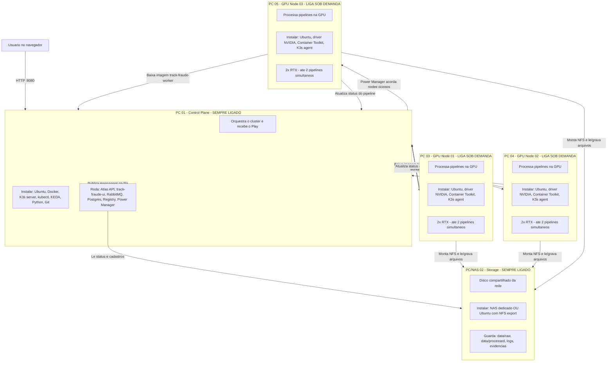
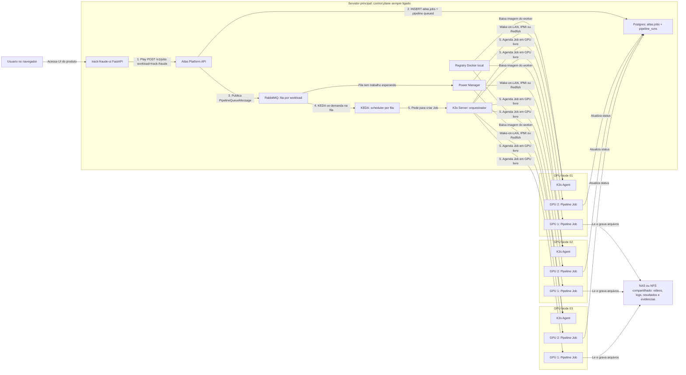

# Entendendo a arquitetura serverless on-prem — Atlas Worker

Este documento explica, do zero, como a plataforma **Atlas Worker** foi pensada para orquestrar jobs GPU on-prem (estilo RunPod).

O repositório `track_fraude` hoje é um **monorepo em evolução**: contém a plataforma Atlas **e** o primeiro produto registrado nela — **track-fraude** (detecção de fraude em self-checkout). Outros produtos (ex.: `kiaia` com vLLM, ComfyUI) podem entrar como workloads adicionais sem mudar a infra base.

**Documentos relacionados:**

| Documento | Conteúdo |
|-----------|----------|
| [fase0_base_operacional.md](fase0_base_operacional.md) | Fila + worker GPU + KEDA (base) |
| [fase1_atlas_fundacao.md](fase1_atlas_fundacao.md) | Platform API + track-fraude como workload #1 |
| [config_control_plane.md](config_control_plane.md) | Instalação passo a passo do control plane |
| [config_node.md](config_node.md) | Instalação dos GPU nodes |
| [plano_execucao.md](../plano_execucao.md) | Roadmap completo (produto + Atlas) |

---

## Plataforma vs produtos

```text
Atlas Worker (plataforma — não executa inferência)
├── Platform API          → POST /v1/jobs, atlas.jobs, publica na fila
├── RabbitMQ + KEDA + K3s → escala workers efêmeros por GPU
├── Postgres atlas.*      → workloads, jobs, pools GPU, API keys
│
└── Produtos (workloads registrados)
    ├── track-fraude      → pipeline YOLO/vídeo, pool video  ← este repo
    ├── kiaia             → vLLM (futuro), pool llm
    └── (outros)          → ComfyUI, etc.
```

| Camada | Responsabilidade | Onde no repo |
|--------|------------------|--------------|
| **Atlas (plataforma)** | Enfileirar, escalar, status, pools GPU | `atlas/platform/`, `infra/k8s/atlas-platform-api.yaml` |
| **Produto track-fraude** | Pipeline, lojas, alertas, revisão | `core/`, `src/`, `jobs/`, `server/` |
| **Infra compartilhada** | Registry, RabbitMQ, Postgres, NFS | `docker-compose.infra.yml`, `infra/k8s/` |

**track-fraude-ui** (`server/`, imagem `track-fraude-server`) é a interface do **produto** — cadastro de lojas, Play, logs, revisão. Não é o núcleo da plataforma; em produção ela chama a **Atlas Platform API**, que enfileira o job.

---

## Ideia principal

Você continua tendo um painel web simples para clicar em Play, mas por trás existe uma estrutura capaz de distribuir pipelines para vários servidores com placa de vídeo — e, no futuro, outros tipos de job GPU (LLM, ComfyUI) no mesmo cluster.

Se hoje você tem um servidor com 2 GPUs, consegue rodar 2 pipelines de vídeo ao mesmo tempo. Se amanhã ligar outro servidor com mais 2 GPUs, o sistema passa a ter capacidade para 4 pipelines simultâneos — sem reconfigurar o painel.

**Fluxo atual (Fase 1 Atlas):**

```text
Play (track-fraude-ui) → Atlas Platform API (workload: track-fraude)
                      → atlas.jobs + RabbitMQ
                      → KEDA → Job GPU → track-fraude-worker
                      → pipeline_runs + arquivos no NAS
```

O painel **não** publica mais direto no RabbitMQ. Quem enfileira é a Platform API.

---

## Programas e servicos para `pipeline.mode: queue`

Quando o painel usa `mode: queue`, ele não executa o pipeline na própria máquina. Ele chama a **Atlas Platform API**, que registra o job e publica a demanda na fila; o cluster distribui o trabalho para os servidores GPU.

### Servidor principal (control plane) — sempre ligado

Este é o servidor que orquestra tudo. Pode ser a máquina onde hoje roda o painel, desde que tenha recursos para manter os serviços abaixo.

| Programa / servico | Para que serve |
|--------------------|----------------|
| **Ubuntu Server** (ou Linux equivalente) | Sistema operacional base |
| **Docker** + **Docker Compose** | Subir registry, RabbitMQ e Postgres; build das imagens |
| **K3s server** | Orquestrador Kubernetes leve (control plane do cluster) |
| **kubectl** | Linha de comando para gerenciar o cluster |
| **KEDA** | Observa a fila RabbitMQ e cria Jobs de worker automaticamente |
| **Registry Docker local** (`registry:2`) | Imagens `atlas-platform-api`, `track-fraude-server`, `track-fraude-worker` |
| **RabbitMQ** | Fila por workload (mensageria entre Platform API e workers) |
| **PostgreSQL** (recomendado em producao) | `atlas.*` (jobs, workloads) + cadastros e `pipeline_runs` do track-fraude |
| **Atlas Platform API** (`atlas-platform-api`) | Gateway serverless: `POST/GET /v1/jobs`, grava `atlas.jobs`, publica na fila |
| **track-fraude-ui** (`track-fraude-server`) | Interface FastAPI do produto (Play → Atlas API) |
| **Power Manager** (`infra/power-manager/`) | Liga/desliga servidores GPU ociosos (Wake-on-LAN, IPMI, Redfish) |
| **Python 3** + **Git** | Build de imagens, schema Atlas, migracao SQLite→Postgres, scripts auxiliares |

Servicos que sobem via `docker-compose.infra.yml` no control plane:

- Registry (`:5000`)
- RabbitMQ (`:5672`, painel de gestao `:15672`)
- Postgres (`:5432`)

A Platform API e o painel do produto rodam no **K3s** (ou localmente em dev). Ver [config_control_plane.md](config_control_plane.md).

### Servidores GPU (nodes) — ligam conforme demanda

Cada servidor com placa de video que vai processar pipelines precisa de:

| Programa / servico | Para que serve |
|--------------------|----------------|
| **Ubuntu Server** | Sistema operacional base |
| **Driver NVIDIA** | Acesso a placa RTX no sistema |
| **NVIDIA Container Toolkit** | Permitir que containers Docker/K3s usem a GPU |
| **K3s agent** | Conectar o servidor ao control plane como node do cluster |
| **NVIDIA Device Plugin** (no cluster) | Expor `nvidia.com/gpu` para o Kubernetes agendar 1 pipeline por GPU |
| **Montagem NFS/NAS** | Ler videos em `data/raw` e gravar resultados em `data/processed` |
| **Acesso ao registry local** | Baixar a imagem `track-fraude-worker` sem depender da internet |

Nos nodes GPU **nao** e obrigatorio instalar Python, venv ou Ultralytics manualmente. O worker roda dentro da imagem Docker.

### Storage compartilhado (NAS ou NFS)

Pode ser um NAS na rede ou uma pasta exportada por um servidor de arquivos. Todos os nodes e o painel precisam enxergar o mesmo caminho de dados.

| Item | Para que serve |
|------|----------------|
| **NAS / servidor NFS** | Disco compartilhado para `data/raw`, `data/processed`, logs e evidencias |
| **Rede estavel** (ideal 2.5GbE ou 10GbE) | Transferir videos grandes entre storage e GPUs |

### O que **nao** precisa no servidor principal em `mode: queue`

No control plane, voce **nao** precisa de:

- Ultralytics / YOLO instalado no host
- PyTorch com CUDA no host
- Worker `.venv` na raiz (o processamento pesado roda nos nodes GPU via container)

O botao Play no painel chama a **Atlas Platform API**; quem processa video e o worker `track-fraude-worker` na GPU.

### Configuracao minima no painel (produto track-fraude)

Em `server/config/settings.yaml` (ou ConfigMap K8s):

```yaml
pipeline:
  mode: queue

atlas:
  api_url: http://192.168.0.199:30090   # NodePort da Platform API no host
  api_key: atlas-dev-internal-key       # Bearer token (trocar em producao)
```

Dentro do cluster K8s, o painel usa `http://atlas-platform-api:8090`. O RabbitMQ fica no Secret da **Platform API** — o painel nao precisa de `queue_url`.

Ordem sugerida de instalacao:

1. Docker + Docker Compose no control plane.
2. Subir registry, RabbitMQ e Postgres (`docker compose -f docker-compose.infra.yml up -d`).
3. Aplicar schema Atlas (`python tools/apply_atlas_schema.py`).
4. Instalar K3s server e kubectl.
5. Instalar KEDA no cluster.
6. Build e push das imagens `atlas-platform-api`, `track-fraude-server` e `track-fraude-worker` para o registry local.
7. Configurar NAS/NFS e aplicar manifests em `infra/k8s/`.
8. Instalar K3s agent + driver NVIDIA nos servidores GPU.
9. Aplicar NVIDIA Device Plugin e validar GPUs (`kubectl describe nodes`).
10. Configurar `pipeline.mode: queue` e `atlas.api_url` no painel.
11. Subir o Power Manager para ligar/desligar nodes GPU automaticamente.

Guia operacional detalhado: [config_control_plane.md](config_control_plane.md) e [fase1_atlas_fundacao.md](fase1_atlas_fundacao.md).

## Plano de maquinas fisicas (`mode: queue`)

Este diagrama e pensado para **planejar quantos PCs/servidores voce precisa comprar ou preparar**. Cada caixa abaixo e uma maquina real na rede. Dentro dela esta o que a maquina faz e o que instalar.

### Exemplo de rede planejada: 5 maquinas

Neste exemplo:

- **1 PC** faz orquestracao e hospeda o painel (sempre ligado).
- **1 NAS** guarda videos e resultados (sempre ligado).
- **3 PCs GPU** processam pipelines (podem ligar/desligar conforme demanda).
- Capacidade maxima: **6 pipelines simultaneos** (3 PCs x 2 GPUs).



### Ficha de cada maquina

#### PC 01 — Control Plane (obrigatorio, sempre ligado)

| Item | Detalhe |
|------|---------|
| **Funcao** | Cerebro da operacao: Atlas API, UI do produto, fila, banco, registry, orquestracao K3s, power manager |
| **Hardware sugerido** | CPU 4+ nucleos, 16 GB RAM, SSD 256 GB+, rede cabeada |
| **GPU** | Nao precisa |
| **Sempre ligado?** | Sim |
| **Instalar no sistema** | Ubuntu Server, Docker, Docker Compose, K3s server, kubectl, KEDA, Python 3, Git |
| **Subir como servico** | Atlas Platform API, track-fraude-ui, RabbitMQ, PostgreSQL, Registry Docker, Power Manager |
| **Portas principais** | `8080`/`30080` UI, `8090`/`30090` Atlas API, `5672` RabbitMQ, `15672` gestao RabbitMQ, `5432` Postgres, `5000` registry |
| **Nao instalar aqui** | Ultralytics, PyTorch, worker `.venv`, YOLO no host |

#### PC/NAS 02 — Storage (obrigatorio, sempre ligado)

| Item | Detalhe |
|------|---------|
| **Funcao** | Disco compartilhado para todos lerem os mesmos videos e gravarem resultados |
| **Hardware sugerido** | NAS com varios TB OU servidor com HDD/SSD grande; rede 2.5GbE ou 10GbE |
| **GPU** | Nao precisa |
| **Sempre ligado?** | Sim |
| **Instalar** | NAS pronto (Synology, TrueNAS etc.) **ou** Ubuntu com `nfs-kernel-server` exportando `/exports/track_fraude/data` |
| **Pastas principais** | `data/raw`, `data/processed`, `data/logs`, clips de evidencia |
| **Quem monta esse disco** | PC 01 (painel), PC 03, PC 04, PC 05 (todos os GPU nodes) |

> **Atalho no inicio:** se ainda nao tiver NAS, o PC 01 pode exportar NFS temporariamente. Para producao com videos grandes, use NAS ou servidor de arquivos dedicado.

> **Guia de instalacao pronto:** passo a passo completo do PC 01 unificado (control + storage) em [`docs/config_control_plane.md`](config_control_plane.md).

#### PC 03, 04, 05 — GPU Nodes (escalaveis, ligam sob demanda)

Cada PC GPU e **igual em software**. Voce replica o mesmo setup em cada maquina nova.

| Item | Detalhe |
|------|---------|
| **Funcao** | Executar 1 pipeline por GPU via container `track-fraude-worker` |
| **Hardware sugerido** | CPU forte, 32 GB+ RAM, 2x RTX (ex.: 5060), SSD 500 GB+, rede cabeada |
| **GPU** | 1 ou mais; cada pipeline reserva `nvidia.com/gpu: 1` |
| **Sempre ligado?** | Nao — power manager pode desligar quando ocioso |
| **Instalar no sistema** | Ubuntu Server, driver NVIDIA, NVIDIA Container Toolkit, K3s agent |
| **Instalar no cluster** | NVIDIA Device Plugin (uma vez no K3s, vale para todos os nodes) |
| **Montar** | NFS do PC/NAS 02 em `/app/data` (ou caminho equivalente) |
| **Acessar** | Registry do PC 01 para baixar imagem do worker |
| **Nao instalar aqui** | Painel web, RabbitMQ, Postgres, Python venv manual, Ultralytics no host |

Capacidade por node:

```text
1 GPU  = 1 pipeline simultaneo
2 GPUs = 2 pipelines simultaneos
```

### Quantos PCs voce precisa?

| Cenario | Maquinas | Capacidade tipica | Quando usar |
|---------|----------|-------------------|-------------|
| **Minimo** | 2 PCs + storage | 1 pipeline por GPU | Teste da arquitetura, 1 servidor GPU |
| **Minimo com NAS separado** | 1 control + 1 NAS + 1 GPU | 1–2 pipelines | Producao pequena |
| **Exemplo deste doc** | 1 control + 1 NAS + 3 GPU | 6 pipelines (3×2 GPUs) | Producao media com economia de energia |
| **Escala** | 1 control + 1 NAS + N GPU | N × GPUs por node | Adicionar PCs GPU sem mudar o painel |

Formula rapida:

```text
Pipelines simultaneos = soma de todas as GPUs em todos os nodes ligados no cluster
```

Exemplos:

```text
1 GPU node com 2 GPUs        = 2 pipelines
3 GPU nodes com 2 GPUs cada  = 6 pipelines
5 GPU nodes com 2 GPUs cada  = 10 pipelines
```

### O que fica em qual maquina — resumo visual

```text
┌─────────────────────────────────────────────────────────────────┐
│ PC 01 - CONTROL PLANE (sempre ligado)                           │
│  • Atlas Platform API (enfileira jobs)                          │
│  • track-fraude-ui (usuario clica Play)                         │
│  • RabbitMQ (fila)                                              │
│  • Postgres (status e cadastros)                                │
│  • Registry (imagens Docker)                                    │
│  • K3s server + KEDA (orquestracao)                             │
│  • Power Manager (liga/desliga GPUs)                            │
└─────────────────────────────────────────────────────────────────┘
          │ fila                    │ imagens           │ status
          ▼                         ▼                   ▼
┌──────────────────┐    ┌──────────────────┐    ┌──────────────────┐
│ PC/NAS 02        │    │ PC 03 GPU        │    │ PC 04 GPU        │
│ STORAGE          │◄───│ 2x RTX           │    │ 2x RTX           │
│ videos/resultados│    │ worker container │    │ worker container │
└──────────────────┘    └──────────────────┘    └──────────────────┘
          ▲                         │
          │                         │
          └─────────────────────────┤
                                    ▼
                          ┌──────────────────┐
                          │ PC 05 GPU        │
                          │ 2x RTX           │
                          │ worker container │
                          └──────────────────┘
```

### Checklist rapido por maquina (para montar o datacenter)

**PC 01 — Control**

- [ ] Ubuntu Server instalado
- [ ] Docker + Docker Compose
- [ ] `docker compose -f docker-compose.infra.yml up -d`
- [ ] K3s server instalado
- [ ] kubectl funcionando
- [ ] KEDA instalado no cluster
- [ ] Imagens atlas-platform-api, server e worker no registry local
- [ ] Schema `atlas.*` aplicado no Postgres
- [ ] Atlas Platform API Running (`GET /v1/health`)
- [ ] Painel com `pipeline.mode: queue` e `atlas.api_url`
- [ ] Power Manager configurado
- [ ] NFS montado (se nao usar NAS separado)

**PC/NAS 02 — Storage**

- [ ] NAS ou NFS export configurado
- [ ] Pasta `track_fraude/data` criada
- [ ] Permissao de leitura/escrita para PC 01 e todos os GPU nodes
- [ ] Backup planejado

**PC 03+ — Cada GPU Node**

- [ ] Ubuntu Server instalado
- [ ] Driver NVIDIA (`nvidia-smi` ok)
- [ ] NVIDIA Container Toolkit
- [ ] K3s agent conectado ao PC 01
- [ ] NFS montado no mesmo caminho de dados
- [ ] Registry do PC 01 configurado em `/etc/rancher/k3s/registries.yaml`
- [ ] Node aparece no cluster com GPUs (`kubectl describe node`)

## 1. O problema que estamos resolvendo

### Modo simples (dev / instalacao unica)

O produto track-fraude funciona de forma direta:

1. Voce abre a UI (`server/`).
2. Escolhe uma loja e uma data.
3. Clica em Play.
4. A propria maquina executa o pipeline localmente (`pipeline.mode: local`).
5. O pipeline processa video, tracking, eventos, alertas e evidencias.

Isso funciona bem enquanto existe uma maquina principal fazendo tudo. Ver [install_server.md](install_server.md).

### Por que a plataforma Atlas existe

O problema aparece quando voce quer crescer — e quando quer **outros produtos GPU** no mesmo datacenter:

- Como rodar varios pipelines ao mesmo tempo?
- Como garantir que cada pipeline use uma GPU livre?
- Como adicionar outro servidor GPU sem reconfigurar tudo manualmente?
- Como enfileirar jobs de produtos diferentes (video, LLM) na mesma infra?
- Como evitar que servidores fiquem ligados sem trabalho?
- Como subir novas versoes do worker rapidamente?

A plataforma **Atlas Worker** resolve isso separando:

- **Plataforma** — enfileirar, escalar, status (Platform API + KEDA + K3s).
- **Produtos** — logica de negocio (track-fraude hoje; kiaia, ComfyUI no futuro).

## 2. A ideia em uma analogia simples

Imagine uma cozinha de restaurante.

No modelo antigo:

- O garcom recebe o pedido.
- O mesmo garcom vai para a cozinha.
- Ele cozinha o prato.
- Ele entrega o prato.

Funciona para poucos pedidos, mas nao escala.

No modelo novo (Atlas + fila):

- O garcom (UI track-fraude) recebe o pedido.
- Ele passa o pedido ao **gerente de pedidos** (Atlas Platform API).
- O gerente registra o job e coloca o pedido na fila certa (por workload).
- A cozinha tem varios cozinheiros (workers GPU por produto).
- Cada cozinheiro pega um pedido quando esta livre.
- Se chega mais demanda, voce coloca mais cozinheiros.
- Se nao tem pedidos, alguns cozinheiros podem ir embora ou desligar a cozinha.

No nosso projeto:

- **track-fraude-ui** e o garcom (interface do produto).
- **Atlas Platform API** e o gerente de pedidos.
- A fila e a lista de pedidos (RabbitMQ, uma fila por workload).
- Cada **track-fraude-worker** e um cozinheiro de video.
- Cada pipeline e um pedido (`workload: track-fraude` + payload).
- K3s/Kubernetes e o gerente da cozinha fisica.
- KEDA observa a fila e cria workers quando precisa.
- O power manager liga/desliga servidores GPU conforme a demanda.

## 3. Diagrama visual da arquitetura

Este desenho mostra uma rede com 1 servidor principal e 3 servidores GPU.

Cada servidor GPU tem 2 placas de video. Entao, no total, esta arquitetura teria capacidade maxima de 6 pipelines ao mesmo tempo.



### Como ler esse desenho

O usuario nao conversa diretamente com os servidores GPU. Ele conversa com a **UI do produto** (track-fraude-ui), que fica no control plane.

Quando voce clica em Play, a UI **nao** publica direto no RabbitMQ. Ela chama a **Atlas Platform API** com `workload: track-fraude` e o payload do pipeline (`store_id`, `date`, etc.). A API grava em `atlas.jobs`, cria/atualiza `pipeline_runs` e publica a mensagem na fila do workload.

O KEDA fica olhando a fila. Quando ele percebe que existem mensagens esperando, ele pede ao K3s/Kubernetes para criar Jobs de worker.

O K3s escolhe onde cada Job vai rodar. Ele olha os nodes GPU conectados e procura uma GPU livre. Como cada pipeline pede 1 GPU, um node com 2 GPUs pode receber ate 2 pipelines ao mesmo tempo.

O registry local guarda a imagem Docker do worker. Quando um node precisa executar um pipeline, ele baixa essa imagem do registry local, sem depender da internet.

O NAS/NFS e o disco compartilhado. Todos os nodes enxergam os mesmos videos, logs e resultados. Por isso qualquer node pode processar qualquer loja/data.

O banco guarda o estado da execucao. Por exemplo:

```text
queued -> running -> completed
queued -> running -> failed
queued -> cancelled
```

O power manager nao processa pipeline. Ele observa se existe trabalho na fila e se existem nodes ociosos ou desligados.

Se existe trabalho esperando e algum node esta desligado, o power manager manda um comando de ligar, como Wake-on-LAN, IPMI ou Redfish. Depois que o node liga e entra no cluster, o K3s passa a enxergar as GPUs dele e pode mandar Jobs para la.

Importante: o K3s nao liga maquina fisica sozinho. O K3s agenda containers em nodes que ja estao ligados e registrados no cluster. Quem liga ou desliga servidor fisico e o power manager.

### Exemplo com 3 nodes e 2 GPUs cada

Capacidade total:

```text
GPU Node 01: 2 pipelines simultaneos
GPU Node 02: 2 pipelines simultaneos
GPU Node 03: 2 pipelines simultaneos
Total: 6 pipelines simultaneos
```

Se entram 4 pipelines na fila:

```text
O KEDA pede 4 Jobs.
O K3s distribui esses 4 Jobs nas GPUs livres.
Ainda sobram 2 GPUs livres.
```

Se entram 10 pipelines na fila:

```text
O KEDA tenta criar Jobs conforme a demanda.
O K3s roda 6 Jobs agora, porque existem 6 GPUs.
Os outros 4 esperam na fila ate alguma GPU liberar.
```

Se os nodes 02 e 03 estavam desligados:

```text
1. RabbitMQ mostra que existe fila.
2. Power manager manda ligar nodes ociosos.
3. Nodes ligam e entram no K3s.
4. K3s passa a ver mais GPUs.
5. KEDA/K3s iniciam mais Jobs.
```

## 4. Os componentes da arquitetura

### track-fraude-ui (painel do produto)

A UI em `server/` e a interface do **produto** track-fraude — nao e o nucleo da plataforma Atlas.

Ela continua responsavel por:

- Login.
- Cadastro de grupos, lojas e cameras.
- Configuracao de zonas e ROI.
- Botao Play do pipeline.
- Acompanhamento de status e logs.
- Revisao de alertas.

No modo `local` (dev), a UI executa o pipeline na propria maquina via subprocesso.

No modo `queue` (producao Atlas), a UI **nao** executa o pipeline nem publica direto no RabbitMQ. Ela chama a **Atlas Platform API** (`server/services/atlas_client.py`) com `workload: track-fraude` e o payload `PipelineQueueMessage`.

Configuracao dev (modo local):

```yaml
pipeline:
  mode: local
```

Producao distribuida (Atlas):

```yaml
pipeline:
  mode: queue

atlas:
  api_url: http://192.168.0.199:30090
  api_key: atlas-dev-internal-key
```

### Atlas Platform API

Servico em `atlas/platform/` — gateway serverless da plataforma.

Responsabilidades:

- Autenticar chamadas (`Authorization: Bearer` + `atlas.api_keys`).
- Resolver `workload_slug` → fila, imagem, pool GPU (tabela `atlas.workloads`).
- Gravar job em `atlas.jobs` e publicar mensagem no RabbitMQ.
- Expor `GET /v1/health`, `POST /v1/jobs`, `GET /v1/jobs/{id}`.

Imagem Docker: `atlas-platform-api:latest`. Deploy: `infra/k8s/atlas-platform-api.yaml`.

Qualquer cliente (UI track-fraude, automacao, okiaia.com no futuro) enfileira jobs pela mesma API informando o `workload` — nao precisa conhecer fila, node ou imagem.

### Worker (produto track-fraude)

O worker e a parte pesada do projeto.

Ele roda:

- OpenCV.
- PyArrow.
- Tesseract.
- Ultralytics/YOLO.
- Tracking.
- Geracao de eventos.
- Merge entre cameras.
- Match com POS.
- Alertas.
- Evidencias em video.

No projeto, essa parte esta principalmente em:

- `jobs/`
- `src/`
- `core/`

Na arquitetura nova, o worker roda dentro de uma imagem Docker chamada, por exemplo:

```text
track-fraude-worker:latest
```

Essa imagem contem tudo que o worker precisa para executar um pipeline.

### Docker image

Uma imagem Docker e como se fosse uma caixa fechada com o programa pronto para rodar.

Em vez de instalar Python, OpenCV, Ultralytics e dependencias manualmente em cada servidor, voce cria uma imagem uma vez e depois todos os servidores rodam essa mesma imagem.

Isso reduz diferencas entre maquinas.

Exemplo:

```text
Servidor GPU 1 roda track-fraude-worker:latest
Servidor GPU 2 roda track-fraude-worker:latest
Servidor GPU 3 roda track-fraude-worker:latest
```

Todos rodam a mesma versao.

### Registry local

O registry local e um servidor interno que guarda as imagens Docker.

Ele funciona como um "Docker Hub particular" dentro da sua rede.

Por que isso e importante?

Porque as imagens do worker podem ser grandes, principalmente por causa de CUDA, PyTorch, OpenCV e YOLO. Se cada servidor precisar baixar da internet, fica lento. Com registry local, os servidores baixam pela rede interna.

Fluxo:

1. Voce gera a imagem do worker.
2. Envia essa imagem para o registry local.
3. Os servidores GPU puxam a imagem do registry local.

Exemplo:

```text
registry local: 192.168.0.10:5000
imagem Atlas API:  192.168.0.10:5000/atlas-platform-api:latest
imagem worker:     192.168.0.10:5000/track-fraude-worker:latest
imagem UI produto: 192.168.0.10:5000/track-fraude-server:latest
```

No futuro, cada workload tera sua propria imagem no mesmo registry (ex.: `kiaia-worker:latest`).

### Fila

A fila e onde ficam os jobs esperando execucao — **uma fila por workload**, configurada em `atlas.workloads`.

Quando voce clica em Play, a UI chama a Platform API, que publica uma mensagem `PipelineQueueMessage`:

```json
{
  "run_id": 123,
  "store_id": "LOJA-01",
  "group_code": "default",
  "date": "2026-05-22"
}
```

Essa mensagem entra na fila.

Depois, um worker GPU pega essa mensagem e executa o pipeline.

Neste projeto, a opcao escolhida foi RabbitMQ, porque ele funciona bem com KEDA e com jobs distribuidos.

### K3s/Kubernetes

Kubernetes e o sistema que organiza containers em varios servidores.

K3s e uma versao mais leve do Kubernetes, boa para usar em servidores proprios, rede local e ambientes menores.

Pense nele como o gerente que sabe:

- Quais servidores estao ligados.
- Quantas GPUs cada servidor tem.
- Quais containers estao rodando.
- Onde existe GPU livre.
- Onde deve iniciar o proximo pipeline.

Se o cluster tem 2 servidores, cada um com 2 GPUs, o Kubernetes enxerga algo como:

```text
gpu-node-01: 2 GPUs
gpu-node-02: 2 GPUs
total: 4 GPUs
```

Cada pipeline pede:

```yaml
nvidia.com/gpu: 1
```

Entao o Kubernetes garante que cada pipeline receba uma GPU.

### KEDA

KEDA e uma ferramenta que observa filas e cria jobs no Kubernetes automaticamente.

No nosso caso:

- Se a fila esta vazia, nao cria worker.
- Se chega 1 mensagem, cria 1 job.
- Se chegam 4 mensagens e existem 4 GPUs livres, cria ate 4 jobs.
- Se chegam 10 mensagens e existem 4 GPUs, roda 4 agora e deixa 6 esperando.

KEDA faz o papel de olhar para a fila e dizer:

```text
Tem trabalho esperando. Kubernetes, crie workers.
```

### NAS/NFS

Os videos e resultados precisam estar acessiveis por todos os servidores.

Por isso usamos um storage compartilhado, como NAS ou NFS.

Ele guarda:

- `data/raw`
- `data/processed`
- `data/logs`
- evidencias
- clips
- arquivos intermediarios

Por que isso e necessario?

Imagine que voce tem dois servidores GPU:

```text
gpu-node-01
gpu-node-02
```

Se o video estiver salvo apenas no disco do `gpu-node-01`, o `gpu-node-02` nao consegue processar esse video.

Com NAS/NFS:

```text
NAS: /exports/track_fraude/data
gpu-node-01 monta esse caminho em /app/data
gpu-node-02 monta esse caminho em /app/data
painel tambem acessa /app/data
```

Assim todos enxergam os mesmos arquivos.

### Banco de dados

Em dev local, o produto track-fraude ainda pode usar SQLite (`data/track_fraude.db`).

Na arquitetura distribuida, o recomendado e **PostgreSQL** compartilhado:

| Schema / tabelas | Conteudo |
|------------------|----------|
| `atlas.*` | Plataforma: `workloads`, `jobs`, `gpu_pools`, `api_keys` |
| Cadastros + `pipeline_runs` | Produto track-fraude: lojas, cameras, execucoes, fases, erros |

O schema Atlas esta em `infra/postgres/schema_atlas.sql`. Aplicar com `python tools/apply_atlas_schema.py`.

Importante: SQLite continua valido no modo `local` para desenvolvimento do produto. Postgres e obrigatorio para producao com varios workers e a Platform API.

### Power manager

O power manager e o componente que economiza energia.

Ele observa:

- Tamanho da fila.
- Se existem pods de worker rodando.
- Quais servidores GPU estao ligados.
- Quanto tempo um servidor esta ocioso.

Se chega demanda e um servidor esta desligado, ele pode acordar esse servidor via Wake-on-LAN.

Se nao tem demanda e o servidor esta parado ha alguns minutos, ele pode:

1. Pedir para o Kubernetes nao mandar novos jobs para aquele servidor.
2. Esperar terminar o que estiver rodando.
3. Desligar o servidor.

Isso nao e feito pelo Kubernetes sozinho. Kubernetes organiza containers, mas ligar e desligar maquina fisica precisa de Wake-on-LAN, IPMI, Redfish, SSH ou outro mecanismo externo.

## 4. Fluxo ponta a ponta

Agora vamos juntar tudo.

### Passo 1: Voce clica em Play

Na UI track-fraude, voce escolhe:

- Grupo.
- Loja.
- Data.

E clica em Play.

### Passo 2: A UI registra a execucao

A UI cria uma execucao em `pipeline_runs` com status:

```text
queued
```

### Passo 3: A UI chama a Atlas Platform API

A UI envia `POST /v1/jobs` com:

```json
{
  "workload": "track-fraude",
  "payload": {
    "run_id": 123,
    "store_id": "LOJA-01",
    "group_code": "default",
    "date": "2026-05-22"
  }
}
```

A Platform API:

1. Valida API key e resolve o workload em `atlas.workloads`.
2. Insere registro em `atlas.jobs`.
3. Publica `PipelineQueueMessage` na fila RabbitMQ do workload.

A UI **nao** fala com RabbitMQ diretamente.

### Passo 4: KEDA ve a fila

KEDA percebe:

```text
Existe 1 mensagem na fila.
```

Entao ele cria um Job Kubernetes.

### Passo 5: Kubernetes escolhe uma GPU livre

O Job pede:

```text
preciso de 1 GPU
```

Kubernetes procura um servidor com GPU livre.

Exemplo:

```text
gpu-node-01 tem 2 GPUs livres
```

Entao o job roda no `gpu-node-01`.

### Passo 6: O worker baixa a imagem do registry local

Se a imagem ainda nao estiver no servidor, o Kubernetes baixa:

```text
192.168.0.10:5000/track-fraude-worker:latest
```

Como o registry esta na rede local, isso e mais rapido.

### Passo 7: O worker pega a mensagem

O worker consome a mensagem da fila.

Ele entende:

```text
Preciso rodar a loja LOJA-01 na data 2026-05-22.
```

### Passo 8: O worker muda o status para running

No banco, a execucao passa de:

```text
queued
```

para:

```text
running
```

E tambem grava informacoes como:

- Nome do node.
- ID do worker.
- ID do job.
- Fase atual.

### Passo 9: O pipeline roda

O worker executa:

1. Ingest.
2. Sync.
3. Track.
4. Events.
5. Merge.
6. POS match.
7. Vision.
8. Alerts.
9. Evidence.

Durante isso, ele atualiza a fase atual no banco.

### Passo 10: Os arquivos sao salvos no NAS/NFS

Tudo que o pipeline gera vai para o storage compartilhado:

```text
/app/data
```

Que corresponde ao `data/` do projeto.

Exemplo:

```text
data/processed/default/LOJA-01/2026-05-22/
data/logs/
```

### Passo 11: O pipeline termina

Se tudo deu certo:

```text
status = completed
```

Se deu erro:

```text
status = failed
```

Se o usuario cancelou:

```text
status = cancelled
```

### Passo 12: Sem fila, os servidores podem desligar

Quando nao ha mais mensagens na fila e nenhum worker rodando, o power manager espera um tempo de seguranca, por exemplo 15 minutos.

Depois pode desligar servidores GPU ociosos.

## 5. Como a escala acontece

Imagine uma fila com 6 pipelines.

### Caso A: um servidor com 2 GPUs

Capacidade:

```text
2 pipelines ao mesmo tempo
```

Execucao:

```text
Rodada 1: pipeline 1 e 2
Rodada 2: pipeline 3 e 4
Rodada 3: pipeline 5 e 6
```

### Caso B: dois servidores com 2 GPUs cada

Capacidade:

```text
4 pipelines ao mesmo tempo
```

Execucao:

```text
Rodada 1: pipeline 1, 2, 3 e 4
Rodada 2: pipeline 5 e 6
```

Voce nao precisa mudar o codigo do pipeline para isso.

Voce adiciona mais servidores GPU ao cluster, e o Kubernetes passa a enxergar mais capacidade.

## 6. Como conectar um novo servidor GPU

De forma conceitual, o passo a passo e:

1. Instalar Ubuntu Server.
2. Instalar driver NVIDIA.
3. Instalar NVIDIA Container Toolkit.
4. Instalar K3s agent apontando para o control plane.
5. Configurar o registry local do K3s.
6. Garantir que o servidor monta o NAS/NFS.
7. Validar que o Kubernetes enxerga a GPU.

Depois disso, esse servidor vira mais um node do cluster.

Se ele tiver 2 GPUs, o cluster ganha capacidade para mais 2 pipelines simultaneos.

## 7. O que fica sempre ligado

Nem tudo deve desligar.

Normalmente ficam sempre ligados:

- Control plane K3s.
- Atlas Platform API.
- track-fraude-ui (ou outras UIs de produto).
- RabbitMQ.
- Registry local.
- Banco de dados (Postgres).
- NAS/NFS.
- Power manager.

Esses componentes sao leves comparados aos servidores GPU.

O que pode desligar:

- Servidores GPU que nao estao processando nada.

## 8. Modo local vs modo queue

### Modo local (dev do produto track-fraude)

Configuracao:

```yaml
pipeline:
  mode: local
```

Comportamento:

- A UI chama o pipeline na propria maquina (subprocesso + `.venv` na raiz).
- Nao precisa de Atlas API, RabbitMQ, K3s ou KEDA.
- Bom para desenvolvimento e teste local do produto.

Este e o modo mais parecido com a instalacao simples (`docs/install_server.md`).

> **Roadmap Atlas Fase 2:** remover modo local em producao; worker e UI totalmente separados.

### Modo queue (producao Atlas)

Configuracao:

```yaml
pipeline:
  mode: queue

atlas:
  api_url: http://<host>:30090
  api_key: <sua-api-key>
```

Comportamento:

- A UI chama a **Atlas Platform API** (`workload: track-fraude`).
- A API grava `atlas.jobs` e publica na fila.
- KEDA cria Jobs no Kubernetes.
- Kubernetes escolhe GPUs livres (pool `video`).
- Workers `track-fraude-worker` rodam em containers.
- Servidores GPU podem escalar; power manager pode ligar/desligar maquinas.

Este e o modo para producao distribuida e para adicionar novos workloads no mesmo cluster.

## 9. O que ja foi preparado no projeto

### Plataforma Atlas

- `atlas/platform/` — Atlas Platform API (FastAPI).
- `atlas/db/` — repositorios e schema.
- `Dockerfile.atlas-platform-api` — imagem da API.
- `infra/k8s/atlas-platform-api.yaml` — deploy no K3s.
- `infra/postgres/schema_atlas.sql` — `atlas.workloads`, `atlas.jobs`, `atlas.gpu_pools`, `atlas.api_keys`.
- `tools/apply_atlas_schema.py` — aplicar schema em Postgres existente.
- `tools/verify_fase1.py` — validacao da Fase 1.

### Produto track-fraude

- `server/services/atlas_client.py` — UI chama Platform API no modo queue.
- `Dockerfile.server` — imagem track-fraude-ui.
- `Dockerfile.worker` — imagem track-fraude-worker GPU.
- `core/src/track_fraude_core/pipeline_queue.py` — contrato `PipelineQueueMessage` (API + worker).
- `jobs/run_pipeline_queue_worker.py` — worker que consome fila e executa pipeline.

### Infra compartilhada

- `.dockerignore` — evita mandar videos e artefatos grandes para o build.
- `docker-compose.infra.yml` — registry, RabbitMQ e Postgres.
- `infra/k8s/` — manifests Kubernetes/K3s (server, worker ScaledJob, config).
- `infra/k3s/registries.yaml.example` — registry local no K3s.
- `infra/postgres/schema.sql` — schema inicial Postgres (produto).
- `tools/migrate_sqlite_to_postgres.py` — copia SQLite → Postgres.
- `infra/power-manager/` — ligar/desligar nodes GPU.

## 10. O que ainda precisa ser entendido antes de colocar em producao

Esta arquitetura envolve infraestrutura real. Antes de rodar em producao, voce precisa definir:

- IP fixo do servidor principal.
- IP/caminho do NAS/NFS.
- Usuario e senha reais do RabbitMQ (Secret K8s).
- Usuario e senha reais do Postgres.
- API key da Platform API (substituir `atlas-dev-internal-key`).
- Nome ou IP do registry local.
- Como os servidores GPU serao acordados: Wake-on-LAN, IPMI ou Redfish.
- Tempo de espera antes de desligar servidor ocioso.
- Rede cabeada adequada, idealmente 2.5GbE ou 10GbE para videos grandes.

---

## 11. Roadmap Atlas (evolucao da plataforma)

| Fase | Nome | Status | Conteudo |
|------|------|--------|----------|
| **0** | Base operacional | Operacional | Fila + worker GPU + KEDA + Postgres |
| **1** | Fundacao Atlas | Implementada | Platform API; track-fraude = workload #1 |
| **2** | Desacoplamento | Planejada | Worker ≠ UI; remover modo local |
| **3** | Atlas Hub MVP | Planejada | UI estilo RunPod — CRUD workloads, registry |
| **4** | Atlas Fleet | Planejada | Nodes, export YAML, power por pool |
| **5** | Nuvem | Planejada | okiaia.com → API + keys por tenant |
| **6** | Multi-workload | Planejada | kiaia (vLLM), ComfyUI, namespaces por produto |

Detalhes: [plano_execucao.md](../plano_execucao.md) (secao Plano Atlas Worker).

---

## 12. O desenho mental mais importante

Se voce lembrar apenas uma coisa, lembre isto:

```text
UI do produto nao processa video.
UI chama Atlas Platform API (workload + payload).
API grava atlas.jobs e publica na fila.
KEDA transforma demanda em Job.
Kubernetes coloca o Job em uma GPU livre.
Worker do produto executa o pipeline.
NAS guarda os arquivos.
Postgres guarda atlas.jobs + pipeline_runs.
Power manager desliga GPU quando nao tem trabalho.
```

Essa e a arquitetura inteira.

## 13. Resumo em uma frase

A arquitetura transforma o datacenter em uma **fabrica serverless GPU**: a plataforma Atlas recebe pedidos, a fila organiza por workload, o Kubernetes distribui para servidores com GPU, os workers de cada produto processam, e os nodes GPU podem crescer ou desligar conforme a demanda. O **track-fraude** e o primeiro produto registrado nessa fabrica.

