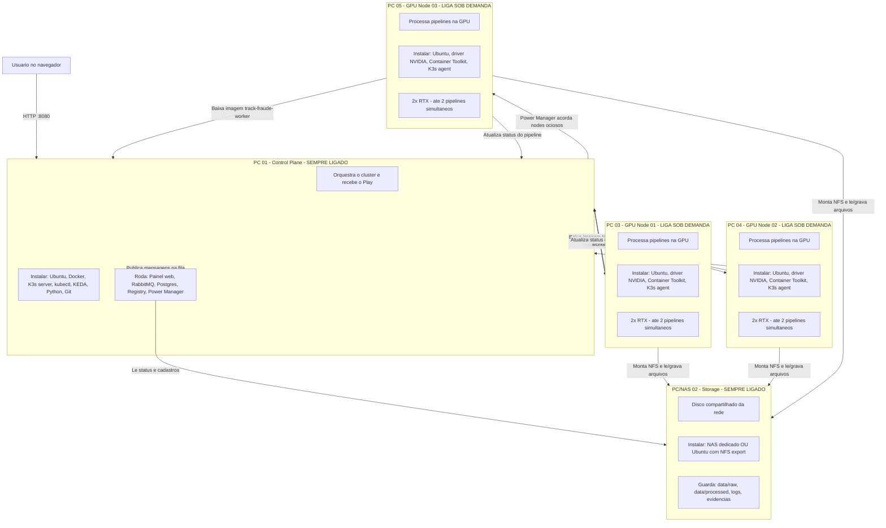
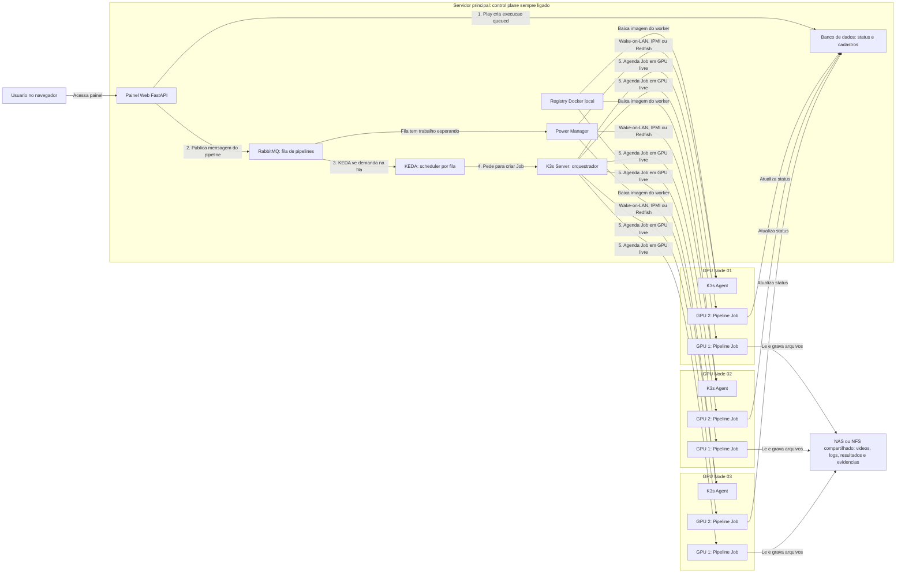

# Entendendo a arquitetura serverless on-prem do track_fraude

Este documento explica, do zero, como a nova arquitetura foi pensada para o `track_fraude`.

A ideia principal e: voce continuar tendo um painel web simples para clicar em Play, mas por tras dele existir uma estrutura capaz de distribuir os pipelines para varios servidores com placa de video. Se hoje voce tem um servidor com 2 GPUs, consegue rodar 2 pipelines ao mesmo tempo. Se amanha ligar outro servidor com mais 2 GPUs, o sistema passa a ter capacidade para 4 pipelines simultaneos.

## Programas e servicos para `pipeline.mode: queue`

Quando o painel usa `mode: queue`, ele nao executa o pipeline na propria maquina. Ele publica demanda na fila e o cluster distribui o trabalho para os servidores GPU. Por isso voce precisa de mais software do que no modo `local`.

A lista abaixo separa o que instalar em cada tipo de maquina.

### Servidor principal (control plane) — sempre ligado

Este e o servidor que orquestra tudo. Pode ser a maquina onde hoje roda o painel, desde que tenha recursos para manter os servicos abaixo.

| Programa / servico | Para que serve |
|--------------------|----------------|
| **Ubuntu Server** (ou Linux equivalente) | Sistema operacional base |
| **Docker** + **Docker Compose** | Subir registry, RabbitMQ e Postgres; build das imagens |
| **K3s server** | Orquestrador Kubernetes leve (control plane do cluster) |
| **kubectl** | Linha de comando para gerenciar o cluster |
| **KEDA** | Observa a fila RabbitMQ e cria Jobs de worker automaticamente |
| **Registry Docker local** (`registry:2`) | Guardar imagens `track-fraude-server` e `track-fraude-worker` na rede interna |
| **RabbitMQ** | Fila de pipelines (mensageria entre painel e workers) |
| **PostgreSQL** (recomendado em producao) | Banco compartilhado para status, cadastros e execucoes concorrentes |
| **Painel web** (`track-fraude-server`) | Interface FastAPI com `pipeline.mode: queue` |
| **Power Manager** (`infra/power-manager/`) | Liga/desliga servidores GPU ociosos (Wake-on-LAN, IPMI, Redfish) |
| **Python 3** + **Git** | Build de imagens, migracao SQLite→Postgres, scripts auxiliares |

Servicos que sobem via `docker-compose.infra.yml` no control plane:

- Registry (`:5000`)
- RabbitMQ (`:5672`, painel de gestao `:15672`)
- Postgres (`:5432`)

### Servidores GPU (nodes) — ligam conforme demanda

Cada servidor com placa de video que vai processar pipelines precisa de:

| Programa / servico | Para que serve |
|--------------------|----------------|
| **Ubuntu Server** | Sistema operacional base |
| **Driver NVIDIA** | Acesso a placa RTX no sistema |
| **NVIDIA Container Toolkit** | Permitir que containers Docker/K3s usem a GPU |
| **K3s agent** | Conectar o servidor ao control plane como node do cluster |
| **NVIDIA Device Plugin** (no cluster) | Expor `nvidia.com/gpu` para o Kubernetes agendar 1 pipeline por GPU |
| **Montagem NFS/NAS** | Ler videos em `data/raw` e gravar resultados em `data/processed` |
| **Acesso ao registry local** | Baixar a imagem `track-fraude-worker` sem depender da internet |

Nos nodes GPU **nao** e obrigatorio instalar Python, venv ou Ultralytics manualmente. O worker roda dentro da imagem Docker.

### Storage compartilhado (NAS ou NFS)

Pode ser um NAS na rede ou uma pasta exportada por um servidor de arquivos. Todos os nodes e o painel precisam enxergar o mesmo caminho de dados.

| Item | Para que serve |
|------|----------------|
| **NAS / servidor NFS** | Disco compartilhado para `data/raw`, `data/processed`, logs e evidencias |
| **Rede estavel** (ideal 2.5GbE ou 10GbE) | Transferir videos grandes entre storage e GPUs |

### O que **nao** precisa no servidor principal em `mode: queue`

No control plane, voce **nao** precisa de:

- Ultralytics / YOLO instalado no host
- PyTorch com CUDA no host
- Worker `.venv` na raiz (o processamento pesado roda nos nodes GPU via container)

O botao Play no painel apenas enfileira; quem processa video e o worker na GPU.

### Configuracao minima no painel

Em `server/config/settings.yaml`:

```yaml
pipeline:
  mode: queue
  queue_url: amqp://track_fraude:track_fraude@<host-rabbitmq>:5672/%2F
  queue_name: track-fraude-pipelines
```

Ordem sugerida de instalacao:

1. Docker + Docker Compose no control plane.
2. Subir registry, RabbitMQ e Postgres (`docker compose -f docker-compose.infra.yml up -d`).
3. Instalar K3s server e kubectl.
4. Instalar KEDA no cluster.
5. Build e push das imagens server e worker para o registry local.
6. Configurar NAS/NFS e aplicar manifests em `infra/k8s/`.
7. Instalar K3s agent + driver NVIDIA nos servidores GPU.
8. Aplicar NVIDIA Device Plugin e validar GPUs (`kubectl describe nodes`).
9. Configurar `pipeline.mode: queue` no painel.
10. Subir o Power Manager para ligar/desligar nodes GPU automaticamente.

Guia operacional detalhado: `infra/README.md`.

## Plano de maquinas fisicas (`mode: queue`)

Este diagrama e pensado para **planejar quantos PCs/servidores voce precisa comprar ou preparar**. Cada caixa abaixo e uma maquina real na rede. Dentro dela esta o que a maquina faz e o que instalar.

### Exemplo de rede planejada: 5 maquinas

Neste exemplo:

- **1 PC** faz orquestracao e hospeda o painel (sempre ligado).
- **1 NAS** guarda videos e resultados (sempre ligado).
- **3 PCs GPU** processam pipelines (podem ligar/desligar conforme demanda).
- Capacidade maxima: **6 pipelines simultaneos** (3 PCs x 2 GPUs).



### Ficha de cada maquina

#### PC 01 — Control Plane (obrigatorio, sempre ligado)

| Item | Detalhe |
|------|---------|
| **Funcao** | Cerebro da operacao: painel web, fila, banco, registry, orquestracao K3s, power manager |
| **Hardware sugerido** | CPU 4+ nucleos, 16 GB RAM, SSD 256 GB+, rede cabeada |
| **GPU** | Nao precisa |
| **Sempre ligado?** | Sim |
| **Instalar no sistema** | Ubuntu Server, Docker, Docker Compose, K3s server, kubectl, KEDA, Python 3, Git |
| **Subir como servico** | Painel (`track-fraude-server`), RabbitMQ, PostgreSQL, Registry Docker, Power Manager |
| **Portas principais** | `8080` painel, `5672` RabbitMQ, `15672` gestao RabbitMQ, `5432` Postgres, `5000` registry |
| **Nao instalar aqui** | Ultralytics, PyTorch, worker `.venv`, YOLO no host |

#### PC/NAS 02 — Storage (obrigatorio, sempre ligado)

| Item | Detalhe |
|------|---------|
| **Funcao** | Disco compartilhado para todos lerem os mesmos videos e gravarem resultados |
| **Hardware sugerido** | NAS com varios TB OU servidor com HDD/SSD grande; rede 2.5GbE ou 10GbE |
| **GPU** | Nao precisa |
| **Sempre ligado?** | Sim |
| **Instalar** | NAS pronto (Synology, TrueNAS etc.) **ou** Ubuntu com `nfs-kernel-server` exportando `/exports/track_fraude/data` |
| **Pastas principais** | `data/raw`, `data/processed`, `data/logs`, clips de evidencia |
| **Quem monta esse disco** | PC 01 (painel), PC 03, PC 04, PC 05 (todos os GPU nodes) |

> **Atalho no inicio:** se ainda nao tiver NAS, o PC 01 pode exportar NFS temporariamente. Para producao com videos grandes, use NAS ou servidor de arquivos dedicado.

> **Guia de instalacao pronto:** passo a passo completo do PC 01 unificado (control + storage) em [`docs/config_control_plane.md`](config_control_plane.md).

#### PC 03, 04, 05 — GPU Nodes (escalaveis, ligam sob demanda)

Cada PC GPU e **igual em software**. Voce replica o mesmo setup em cada maquina nova.

| Item | Detalhe |
|------|---------|
| **Funcao** | Executar 1 pipeline por GPU via container `track-fraude-worker` |
| **Hardware sugerido** | CPU forte, 32 GB+ RAM, 2x RTX (ex.: 5060), SSD 500 GB+, rede cabeada |
| **GPU** | 1 ou mais; cada pipeline reserva `nvidia.com/gpu: 1` |
| **Sempre ligado?** | Nao — power manager pode desligar quando ocioso |
| **Instalar no sistema** | Ubuntu Server, driver NVIDIA, NVIDIA Container Toolkit, K3s agent |
| **Instalar no cluster** | NVIDIA Device Plugin (uma vez no K3s, vale para todos os nodes) |
| **Montar** | NFS do PC/NAS 02 em `/app/data` (ou caminho equivalente) |
| **Acessar** | Registry do PC 01 para baixar imagem do worker |
| **Nao instalar aqui** | Painel web, RabbitMQ, Postgres, Python venv manual, Ultralytics no host |

Capacidade por node:

```text
1 GPU  = 1 pipeline simultaneo
2 GPUs = 2 pipelines simultaneos
```

### Quantos PCs voce precisa?

| Cenario | Maquinas | Capacidade tipica | Quando usar |
|---------|----------|-------------------|-------------|
| **Minimo** | 2 PCs + storage | 1 pipeline por GPU | Teste da arquitetura, 1 servidor GPU |
| **Minimo com NAS separado** | 1 control + 1 NAS + 1 GPU | 1–2 pipelines | Producao pequena |
| **Exemplo deste doc** | 1 control + 1 NAS + 3 GPU | 6 pipelines (3×2 GPUs) | Producao media com economia de energia |
| **Escala** | 1 control + 1 NAS + N GPU | N × GPUs por node | Adicionar PCs GPU sem mudar o painel |

Formula rapida:

```text
Pipelines simultaneos = soma de todas as GPUs em todos os nodes ligados no cluster
```

Exemplos:

```text
1 GPU node com 2 GPUs        = 2 pipelines
3 GPU nodes com 2 GPUs cada  = 6 pipelines
5 GPU nodes com 2 GPUs cada  = 10 pipelines
```

### O que fica em qual maquina — resumo visual

```text
┌─────────────────────────────────────────────────────────────────┐
│ PC 01 - CONTROL PLANE (sempre ligado)                           │
│  • Painel web (usuario clica Play)                              │
│  • RabbitMQ (fila)                                              │
│  • Postgres (status e cadastros)                                │
│  • Registry (imagens Docker)                                    │
│  • K3s server + KEDA (orquestracao)                             │
│  • Power Manager (liga/desliga GPUs)                            │
└─────────────────────────────────────────────────────────────────┘
          │ fila                    │ imagens           │ status
          ▼                         ▼                   ▼
┌──────────────────┐    ┌──────────────────┐    ┌──────────────────┐
│ PC/NAS 02        │    │ PC 03 GPU        │    │ PC 04 GPU        │
│ STORAGE          │◄───│ 2x RTX           │    │ 2x RTX           │
│ videos/resultados│    │ worker container │    │ worker container │
└──────────────────┘    └──────────────────┘    └──────────────────┘
          ▲                         │
          │                         │
          └─────────────────────────┤
                                    ▼
                          ┌──────────────────┐
                          │ PC 05 GPU        │
                          │ 2x RTX           │
                          │ worker container │
                          └──────────────────┘
```

### Checklist rapido por maquina (para montar o datacenter)

**PC 01 — Control**

- [ ] Ubuntu Server instalado
- [ ] Docker + Docker Compose
- [ ] `docker compose -f docker-compose.infra.yml up -d`
- [ ] K3s server instalado
- [ ] kubectl funcionando
- [ ] KEDA instalado no cluster
- [ ] Imagens server e worker no registry local
- [ ] Painel com `pipeline.mode: queue`
- [ ] Power Manager configurado
- [ ] NFS montado (se nao usar NAS separado)

**PC/NAS 02 — Storage**

- [ ] NAS ou NFS export configurado
- [ ] Pasta `track_fraude/data` criada
- [ ] Permissao de leitura/escrita para PC 01 e todos os GPU nodes
- [ ] Backup planejado

**PC 03+ — Cada GPU Node**

- [ ] Ubuntu Server instalado
- [ ] Driver NVIDIA (`nvidia-smi` ok)
- [ ] NVIDIA Container Toolkit
- [ ] K3s agent conectado ao PC 01
- [ ] NFS montado no mesmo caminho de dados
- [ ] Registry do PC 01 configurado em `/etc/rancher/k3s/registries.yaml`
- [ ] Node aparece no cluster com GPUs (`kubectl describe node`)

## 1. O problema que estamos resolvendo

Hoje o projeto funciona de forma simples:

1. Voce abre o painel web.
2. Escolhe uma loja e uma data.
3. Clica em Play.
4. O proprio servidor do painel chama o pipeline localmente.
5. O pipeline processa video, tracking, eventos, alertas e evidencias.

Isso funciona bem enquanto existe uma maquina principal fazendo tudo.

O problema aparece quando voce quer crescer:

- Como rodar varios pipelines ao mesmo tempo?
- Como garantir que cada pipeline use uma GPU livre?
- Como adicionar outro servidor GPU sem reconfigurar tudo manualmente?
- Como evitar que servidores fiquem ligados sem trabalho?
- Como subir novas versoes do worker rapidamente?

A arquitetura nova resolve isso separando as responsabilidades.

## 2. A ideia em uma analogia simples

Imagine uma cozinha de restaurante.

No modelo antigo:

- O garcom recebe o pedido.
- O mesmo garcom vai para a cozinha.
- Ele cozinha o prato.
- Ele entrega o prato.

Funciona para poucos pedidos, mas nao escala.

No modelo novo:

- O garcom recebe o pedido.
- Ele coloca o pedido numa fila.
- A cozinha tem varios cozinheiros.
- Cada cozinheiro pega um pedido quando esta livre.
- Se chega mais demanda, voce coloca mais cozinheiros.
- Se nao tem pedidos, alguns cozinheiros podem ir embora ou desligar a cozinha.

No nosso projeto:

- O painel web e o garcom.
- A fila e a lista de pedidos.
- Cada worker GPU e um cozinheiro.
- Cada pipeline e um pedido.
- K3s/Kubernetes e o gerente da cozinha.
- KEDA observa a fila e cria workers quando precisa.
- O power manager liga/desliga servidores GPU conforme a demanda.

## 3. Diagrama visual da arquitetura

Este desenho mostra uma rede com 1 servidor principal e 3 servidores GPU.

Cada servidor GPU tem 2 placas de video. Entao, no total, esta arquitetura teria capacidade maxima de 6 pipelines ao mesmo tempo.



### Como ler esse desenho

O usuario nao conversa diretamente com os servidores GPU. Ele conversa com o painel web, que fica no servidor principal.

Quando voce clica em Play, o painel nao precisa saber qual GPU vai executar o trabalho. O painel apenas cria uma execucao no banco e coloca uma mensagem na fila RabbitMQ.

O KEDA fica olhando a fila. Quando ele percebe que existem mensagens esperando, ele pede ao K3s/Kubernetes para criar Jobs de worker.

O K3s escolhe onde cada Job vai rodar. Ele olha os nodes GPU conectados e procura uma GPU livre. Como cada pipeline pede 1 GPU, um node com 2 GPUs pode receber ate 2 pipelines ao mesmo tempo.

O registry local guarda a imagem Docker do worker. Quando um node precisa executar um pipeline, ele baixa essa imagem do registry local, sem depender da internet.

O NAS/NFS e o disco compartilhado. Todos os nodes enxergam os mesmos videos, logs e resultados. Por isso qualquer node pode processar qualquer loja/data.

O banco guarda o estado da execucao. Por exemplo:

```text
queued -> running -> completed
queued -> running -> failed
queued -> cancelled
```

O power manager nao processa pipeline. Ele observa se existe trabalho na fila e se existem nodes ociosos ou desligados.

Se existe trabalho esperando e algum node esta desligado, o power manager manda um comando de ligar, como Wake-on-LAN, IPMI ou Redfish. Depois que o node liga e entra no cluster, o K3s passa a enxergar as GPUs dele e pode mandar Jobs para la.

Importante: o K3s nao liga maquina fisica sozinho. O K3s agenda containers em nodes que ja estao ligados e registrados no cluster. Quem liga ou desliga servidor fisico e o power manager.

### Exemplo com 3 nodes e 2 GPUs cada

Capacidade total:

```text
GPU Node 01: 2 pipelines simultaneos
GPU Node 02: 2 pipelines simultaneos
GPU Node 03: 2 pipelines simultaneos
Total: 6 pipelines simultaneos
```

Se entram 4 pipelines na fila:

```text
O KEDA pede 4 Jobs.
O K3s distribui esses 4 Jobs nas GPUs livres.
Ainda sobram 2 GPUs livres.
```

Se entram 10 pipelines na fila:

```text
O KEDA tenta criar Jobs conforme a demanda.
O K3s roda 6 Jobs agora, porque existem 6 GPUs.
Os outros 4 esperam na fila ate alguma GPU liberar.
```

Se os nodes 02 e 03 estavam desligados:

```text
1. RabbitMQ mostra que existe fila.
2. Power manager manda ligar nodes ociosos.
3. Nodes ligam e entram no K3s.
4. K3s passa a ver mais GPUs.
5. KEDA/K3s iniciam mais Jobs.
```

## 4. Os componentes da arquitetura

### Painel web

O painel web continua sendo a interface que voce usa no navegador.

Ele fica em `server/` e continua responsavel por:

- Login.
- Cadastro de grupos, lojas e cameras.
- Configuracao de zonas e ROI.
- Botao Play do pipeline.
- Acompanhamento de status e logs.
- Revisao de alertas.

No modo atual, chamado `local`, o painel executa o pipeline na propria maquina.

No modo novo, chamado `queue`, o painel nao executa o pipeline diretamente. Ele apenas cria uma demanda e coloca essa demanda na fila.

Configuracao atual:

```yaml
pipeline:
  mode: local
```

Quando quiser usar a arquitetura distribuida:

```yaml
pipeline:
  mode: queue
```

### Worker

O worker e a parte pesada do projeto.

Ele roda:

- OpenCV.
- PyArrow.
- Tesseract.
- Ultralytics/YOLO.
- Tracking.
- Geracao de eventos.
- Merge entre cameras.
- Match com POS.
- Alertas.
- Evidencias em video.

No projeto, essa parte esta principalmente em:

- `jobs/`
- `src/`
- `core/`

Na arquitetura nova, o worker roda dentro de uma imagem Docker chamada, por exemplo:

```text
track-fraude-worker:latest
```

Essa imagem contem tudo que o worker precisa para executar um pipeline.

### Docker image

Uma imagem Docker e como se fosse uma caixa fechada com o programa pronto para rodar.

Em vez de instalar Python, OpenCV, Ultralytics e dependencias manualmente em cada servidor, voce cria uma imagem uma vez e depois todos os servidores rodam essa mesma imagem.

Isso reduz diferencas entre maquinas.

Exemplo:

```text
Servidor GPU 1 roda track-fraude-worker:latest
Servidor GPU 2 roda track-fraude-worker:latest
Servidor GPU 3 roda track-fraude-worker:latest
```

Todos rodam a mesma versao.

### Registry local

O registry local e um servidor interno que guarda as imagens Docker.

Ele funciona como um "Docker Hub particular" dentro da sua rede.

Por que isso e importante?

Porque as imagens do worker podem ser grandes, principalmente por causa de CUDA, PyTorch, OpenCV e YOLO. Se cada servidor precisar baixar da internet, fica lento. Com registry local, os servidores baixam pela rede interna.

Fluxo:

1. Voce gera a imagem do worker.
2. Envia essa imagem para o registry local.
3. Os servidores GPU puxam a imagem do registry local.

Exemplo:

```text
registry local: 192.168.0.10:5000
imagem worker: 192.168.0.10:5000/track-fraude-worker:latest
imagem painel: 192.168.0.10:5000/track-fraude-server:latest
```

### Fila

A fila e onde ficam os pipelines esperando execucao.

Quando voce clica em Play, o painel cria uma mensagem parecida com:

```json
{
  "run_id": 123,
  "store_id": "LOJA-01",
  "group_code": "default",
  "date": "2026-05-22"
}
```

Essa mensagem entra na fila.

Depois, um worker GPU pega essa mensagem e executa o pipeline.

Neste projeto, a opcao escolhida foi RabbitMQ, porque ele funciona bem com KEDA e com jobs distribuidos.

### K3s/Kubernetes

Kubernetes e o sistema que organiza containers em varios servidores.

K3s e uma versao mais leve do Kubernetes, boa para usar em servidores proprios, rede local e ambientes menores.

Pense nele como o gerente que sabe:

- Quais servidores estao ligados.
- Quantas GPUs cada servidor tem.
- Quais containers estao rodando.
- Onde existe GPU livre.
- Onde deve iniciar o proximo pipeline.

Se o cluster tem 2 servidores, cada um com 2 GPUs, o Kubernetes enxerga algo como:

```text
gpu-node-01: 2 GPUs
gpu-node-02: 2 GPUs
total: 4 GPUs
```

Cada pipeline pede:

```yaml
nvidia.com/gpu: 1
```

Entao o Kubernetes garante que cada pipeline receba uma GPU.

### KEDA

KEDA e uma ferramenta que observa filas e cria jobs no Kubernetes automaticamente.

No nosso caso:

- Se a fila esta vazia, nao cria worker.
- Se chega 1 mensagem, cria 1 job.
- Se chegam 4 mensagens e existem 4 GPUs livres, cria ate 4 jobs.
- Se chegam 10 mensagens e existem 4 GPUs, roda 4 agora e deixa 6 esperando.

KEDA faz o papel de olhar para a fila e dizer:

```text
Tem trabalho esperando. Kubernetes, crie workers.
```

### NAS/NFS

Os videos e resultados precisam estar acessiveis por todos os servidores.

Por isso usamos um storage compartilhado, como NAS ou NFS.

Ele guarda:

- `data/raw`
- `data/processed`
- `data/logs`
- evidencias
- clips
- arquivos intermediarios

Por que isso e necessario?

Imagine que voce tem dois servidores GPU:

```text
gpu-node-01
gpu-node-02
```

Se o video estiver salvo apenas no disco do `gpu-node-01`, o `gpu-node-02` nao consegue processar esse video.

Com NAS/NFS:

```text
NAS: /exports/track_fraude/data
gpu-node-01 monta esse caminho em /app/data
gpu-node-02 monta esse caminho em /app/data
painel tambem acessa /app/data
```

Assim todos enxergam os mesmos arquivos.

### Banco de dados

Hoje o projeto usa SQLite.

SQLite e simples e funciona bem localmente, mas nao e ideal quando varios servidores escrevem ao mesmo tempo.

Na arquitetura distribuida, o recomendado e Postgres.

O banco guarda:

- Lojas.
- Grupos.
- Cameras.
- Usuarios.
- Execucoes de pipeline.
- Status do pipeline.
- Fase atual.
- Erros.
- Historico.

Importante: o projeto ainda continua funcionando com SQLite no modo local. A migracao para Postgres e o caminho recomendado para producao distribuida.

### Power manager

O power manager e o componente que economiza energia.

Ele observa:

- Tamanho da fila.
- Se existem pods de worker rodando.
- Quais servidores GPU estao ligados.
- Quanto tempo um servidor esta ocioso.

Se chega demanda e um servidor esta desligado, ele pode acordar esse servidor via Wake-on-LAN.

Se nao tem demanda e o servidor esta parado ha alguns minutos, ele pode:

1. Pedir para o Kubernetes nao mandar novos jobs para aquele servidor.
2. Esperar terminar o que estiver rodando.
3. Desligar o servidor.

Isso nao e feito pelo Kubernetes sozinho. Kubernetes organiza containers, mas ligar e desligar maquina fisica precisa de Wake-on-LAN, IPMI, Redfish, SSH ou outro mecanismo externo.

## 4. Fluxo ponta a ponta

Agora vamos juntar tudo.

### Passo 1: Voce clica em Play

No painel, voce escolhe:

- Grupo.
- Loja.
- Data.

E clica em Play.

### Passo 2: O painel registra a execucao

O painel cria uma execucao no banco com status:

```text
queued
```

Isso significa:

```text
O pipeline foi solicitado, mas ainda nao comecou a processar.
```

### Passo 3: O painel envia uma mensagem para a fila

O painel publica uma mensagem no RabbitMQ.

Essa mensagem informa:

- ID da execucao.
- Loja.
- Grupo.
- Data.
- Caminho do banco.
- Opcoes do pipeline.

### Passo 4: KEDA ve a fila

KEDA percebe:

```text
Existe 1 mensagem na fila.
```

Entao ele cria um Job Kubernetes.

### Passo 5: Kubernetes escolhe uma GPU livre

O Job pede:

```text
preciso de 1 GPU
```

Kubernetes procura um servidor com GPU livre.

Exemplo:

```text
gpu-node-01 tem 2 GPUs livres
```

Entao o job roda no `gpu-node-01`.

### Passo 6: O worker baixa a imagem do registry local

Se a imagem ainda nao estiver no servidor, o Kubernetes baixa:

```text
192.168.0.10:5000/track-fraude-worker:latest
```

Como o registry esta na rede local, isso e mais rapido.

### Passo 7: O worker pega a mensagem

O worker consome a mensagem da fila.

Ele entende:

```text
Preciso rodar a loja LOJA-01 na data 2026-05-22.
```

### Passo 8: O worker muda o status para running

No banco, a execucao passa de:

```text
queued
```

para:

```text
running
```

E tambem grava informacoes como:

- Nome do node.
- ID do worker.
- ID do job.
- Fase atual.

### Passo 9: O pipeline roda

O worker executa:

1. Ingest.
2. Sync.
3. Track.
4. Events.
5. Merge.
6. POS match.
7. Vision.
8. Alerts.
9. Evidence.

Durante isso, ele atualiza a fase atual no banco.

### Passo 10: Os arquivos sao salvos no NAS/NFS

Tudo que o pipeline gera vai para o storage compartilhado:

```text
/app/data
```

Que corresponde ao `data/` do projeto.

Exemplo:

```text
data/processed/default/LOJA-01/2026-05-22/
data/logs/
```

### Passo 11: O pipeline termina

Se tudo deu certo:

```text
status = completed
```

Se deu erro:

```text
status = failed
```

Se o usuario cancelou:

```text
status = cancelled
```

### Passo 12: Sem fila, os servidores podem desligar

Quando nao ha mais mensagens na fila e nenhum worker rodando, o power manager espera um tempo de seguranca, por exemplo 15 minutos.

Depois pode desligar servidores GPU ociosos.

## 5. Como a escala acontece

Imagine uma fila com 6 pipelines.

### Caso A: um servidor com 2 GPUs

Capacidade:

```text
2 pipelines ao mesmo tempo
```

Execucao:

```text
Rodada 1: pipeline 1 e 2
Rodada 2: pipeline 3 e 4
Rodada 3: pipeline 5 e 6
```

### Caso B: dois servidores com 2 GPUs cada

Capacidade:

```text
4 pipelines ao mesmo tempo
```

Execucao:

```text
Rodada 1: pipeline 1, 2, 3 e 4
Rodada 2: pipeline 5 e 6
```

Voce nao precisa mudar o codigo do pipeline para isso.

Voce adiciona mais servidores GPU ao cluster, e o Kubernetes passa a enxergar mais capacidade.

## 6. Como conectar um novo servidor GPU

De forma conceitual, o passo a passo e:

1. Instalar Ubuntu Server.
2. Instalar driver NVIDIA.
3. Instalar NVIDIA Container Toolkit.
4. Instalar K3s agent apontando para o control plane.
5. Configurar o registry local do K3s.
6. Garantir que o servidor monta o NAS/NFS.
7. Validar que o Kubernetes enxerga a GPU.

Depois disso, esse servidor vira mais um node do cluster.

Se ele tiver 2 GPUs, o cluster ganha capacidade para mais 2 pipelines simultaneos.

## 7. O que fica sempre ligado

Nem tudo deve desligar.

Normalmente ficam sempre ligados:

- Control plane K3s.
- Painel web.
- RabbitMQ.
- Registry local.
- Banco de dados.
- NAS/NFS.
- Power manager.

Esses componentes sao leves comparados aos servidores GPU.

O que pode desligar:

- Servidores GPU que nao estao processando nada.

## 8. Modo local vs modo queue

### Modo local

Configuracao:

```yaml
pipeline:
  mode: local
```

Comportamento:

- O painel chama o pipeline na propria maquina.
- Nao precisa de RabbitMQ.
- Nao precisa de K3s.
- Nao precisa de KEDA.
- Bom para desenvolvimento e teste local.

Este e o modo mais parecido com o funcionamento atual.

### Modo queue

Configuracao:

```yaml
pipeline:
  mode: queue
```

Comportamento:

- O painel coloca a demanda na fila.
- KEDA cria Jobs.
- Kubernetes escolhe GPUs livres.
- Workers rodam em containers.
- Servidores GPU podem escalar.
- Power manager pode ligar/desligar maquinas.

Este e o modo para producao distribuida.

## 9. O que ja foi preparado no projeto

Foram adicionados arquivos para preparar essa arquitetura:

- `Dockerfile.server`: imagem do painel web.
- `Dockerfile.worker`: imagem do worker GPU.
- `.dockerignore`: evita mandar videos, bancos e artefatos grandes para o build Docker.
- `docker-compose.infra.yml`: sobe registry, RabbitMQ e Postgres para apoio local.
- `infra/k8s/`: manifests Kubernetes/K3s.
- `infra/k3s/registries.yaml.example`: exemplo de registry local no K3s.
- `infra/postgres/schema.sql`: schema inicial Postgres.
- `tools/migrate_sqlite_to_postgres.py`: copia dados do SQLite atual para Postgres.
- `infra/power-manager/`: exemplo de gerenciador para ligar/desligar nodes GPU.
- `core/src/track_fraude_core/pipeline_queue.py`: contrato da mensagem que vai para a fila.
- `jobs/run_pipeline_queue_worker.py`: worker que consome uma mensagem da fila e executa o pipeline.

## 10. O que ainda precisa ser entendido antes de colocar em producao

Esta arquitetura envolve infraestrutura real. Antes de rodar em producao, voce precisa definir:

- IP fixo do servidor principal.
- IP/caminho do NAS/NFS.
- Usuario e senha reais do RabbitMQ.
- Usuario e senha reais do Postgres.
- Nome ou IP do registry local.
- Como os servidores GPU serao acordados: Wake-on-LAN, IPMI ou Redfish.
- Tempo de espera antes de desligar servidor ocioso.
- Rede cabeada adequada, idealmente 2.5GbE ou 10GbE para videos grandes.

## 11. O desenho mental mais importante

Se voce lembrar apenas uma coisa, lembre isto:

```text
Painel nao precisa processar video.
Painel cria uma demanda.
Fila guarda a demanda.
KEDA transforma demanda em Job.
Kubernetes coloca o Job em uma GPU livre.
Worker executa o pipeline.
NAS guarda os arquivos.
Banco guarda o status.
Power manager desliga GPU quando nao tem trabalho.
```

Essa e a arquitetura inteira.

## 12. Resumo em uma frase

A arquitetura transforma o `track_fraude` em uma fabrica de processamento: o painel recebe pedidos, a fila organiza esses pedidos, o Kubernetes distribui para servidores com GPU, os workers processam os videos, e os servidores GPU podem crescer ou desligar conforme a demanda.

