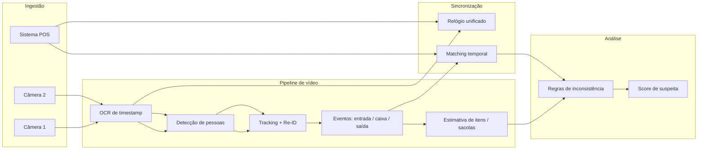
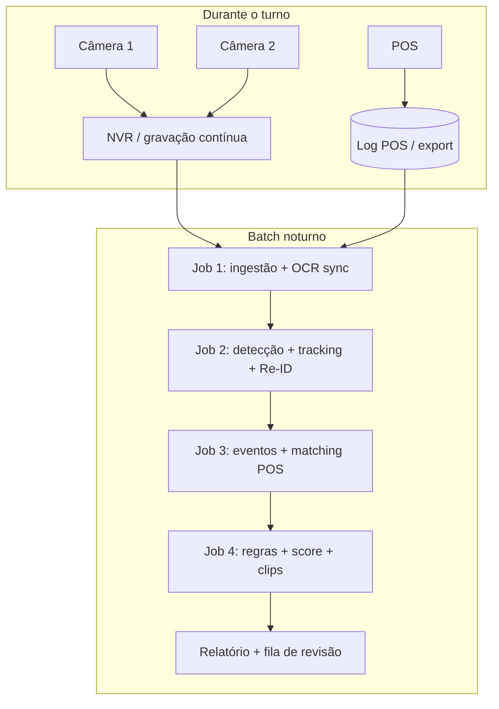
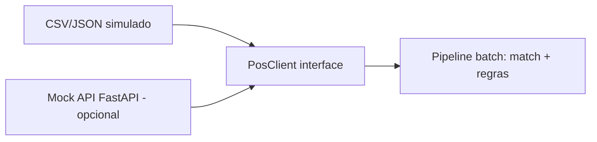
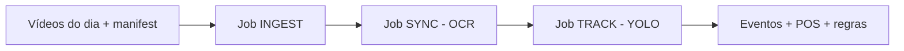
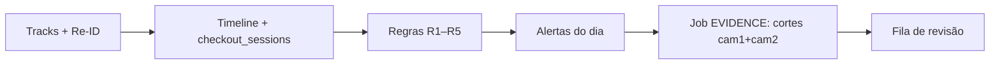

## Visão geral

O problema se divide em **5 camadas** que precisam conversar por timestamps confiáveis:



A parte mais crítica não é só “detectar pessoa”, e sim **(a) sincronizar relógios**, **(b) associar pessoa ↔ transação**, **(c) estimar quantidade de itens com confiança suficiente para acusar fraude**.

---

## 1. Arquitetura recomendada (modular)

### A. Ingestão e armazenamento
- **Vídeo**: gravação contínua ou clipes por evento (RTSP/NVR → object storage).
- **POS**: webhook, polling de API ou exportação de logs (ideal: evento em tempo quase real).
- **Metadados**: Postgres ou TimescaleDB para eventos; object storage para vídeo/clips.

### B. Pipeline de vídeo (offline ou near-real-time)
Por câmera, em paralelo:

| Etapa | Função |
|-------|--------|
| **Extrator de timestamp** | OCR na região do overlay (data/hora no frame) |
| **Detecção** | Pessoas (+ opcional: sacolas, carrinho, produtos na mão) |
| **Tracking** | ID local por câmera frame a frame |
| **Re-ID cross-camera** | Mesma pessoa entre câmera 1 e 2 |
| **Geofencing** | Zonas: entrada, corredor, self-checkout, saída |
| **FSM por track** | Máquina de estados: `ENTERED → AT_CHECKOUT → LEFT` |

### C. Camada de sincronização temporal
- Converter tudo para **`UTC` ou timezone da loja** com offset por câmera.
- Calibrar drift: OCR do vídeo vs horário do servidor POS (amostragem periódica).
- Guardar para cada frame/track: `t_video`, `t_pos`, `confidence_sync`.

### D. Motor de associação pessoa ↔ transação
- Para cada intervalo `[t_start, t_end]` em que o track ficou na zona de checkout:
  - buscar transações POS com `t_sale ∈ [t_start - δ, t_end + δ]`
  - δ típico: 30–90 s (pagamento, sacola, saída)
- Se **0 transações** → alerta alto.
- Se **>1 transação** → desambiguar por proximidade temporal ou número de tracks simultâneos na zona.

### E. Motor de inconsistência + score
Regras ponderadas → score 0–100:

| Sinal | Peso típico |
|-------|-------------|
| Permaneceu no caixa, sem venda no intervalo | Alto |
| Venda com 1 item, visualmente muitos itens/sacolas | Alto |
| Tempo no caixa muito curto para N itens visuais | Médio |
| Saiu com sacola grande, transação vazia/cancelada | Alto |
| Múltiplas pessoas no mesmo caixa (overlap) | Reduz confiança |

Saída: alerta + clip de evidência + timeline + transação associada (ou ausência).

---

## 2. Visão computacional: o que usar

### Detecção de pessoas
- **YOLOv8/v11**, **RT-DETR** ou modelos similares — boa relação velocidade/precisão.
- Classes extras úteis: `bag`, `backpack`, `shopping_basket`, `cart` (se visível).

### Tracking (single camera)
- **ByteTrack** ou **BoT-SORT**: robustos em multitudes moderadas.
- Produz `track_id` local por câmera.

### Re-identificação entre 2 câmeras
Opções, da mais simples à mais robusta:

1. **Zonas + tempo**: se câmera 1 cobre entrada e câmera 2 cobre checkout, associe por ordem temporal + aparência (embedding Re-ID).
2. **Embedding Re-ID** (OSNet, FastReID): comparar vetor de aparência entre tracks das duas câmeras em janela temporal.
3. **Grafo global**: nós = tracks; arestas = compatibilidade temporal + visual.

Para 2 câmeras bem posicionadas, **Re-ID + janela temporal** costuma bastar.

### OCR de timestamp no vídeo
- Região fixa (ROI) onde o overlay aparece.
- **PaddleOCR**, **EasyOCR** ou Tesseract com pré-processamento (binarização, contraste).
- Validar formato (`DD/MM/YYYY HH:MM:SS`) e detectar saltos/anomalias.
- Fallback: FPS × frame index ancorado em OCR a cada N segundos.

**Sem sync confiável, todo o resto quebra.**

### Zonas e eventos
Defina polígonos por câmera (ferramenta tipo CVAT ou script):

```
ENTRADA → CORREDOR → SELF_CHECKOUT_1..N → SAÍDA
```

Eventos derivados:
- `person_entered_store(t)`
- `person_at_checkout(track_id, lane_id, t_start, t_end)`
- `person_left_store(t)`

Use **histerese** (ex.: 3 s dentro da zona para confirmar “permanência no caixa”) para evitar flicker.

---

## 3. Contagem visual de itens (parte mais difícil)

Contar “5 itens na sacola” só com câmera de segurança é **impreciso**. Abordagem pragmática em fases:

### Fase 1 — proxies visuais (MVP)
Não contar itens exatos; usar sinais:
- presença/ausência de **sacola volumosa**
- **número de objetos na mão** (detecção fraca)
- **tempo no caixa** vs **quantidade POS**
- **movimentos de scan** (opcional: pose/mão na área do scanner)

Regra exemplo:
> sacola grande detectada + POS = 1 item + tempo > 60 s → suspeita média/alta

### Fase 2 — contagem aproximada
- Detecção de objetos pequenos na área do checkout (ROI apertada).
- Tracking de objetos colocados na sacola (zonas de “área de embalagem”).
- Contagem por **eventos de movimento** (objeto entra na sacola).

### Fase 3 — fusão com sensores (ideal em produção)
Se possível na loja:
- **Balança do checkout** (peso total vs itens escaneados)
- **RFID/antena** em itens de alto valor
- **Câmera dedicada no checkout** (top-down no scanner)

Para acusar fraude com baixa taxa de falso positivo, **peso + POS + vídeo** é muito superior a só vídeo amplo.

---

## 4. Sincronização vídeo ↔ POS

### Modelo de dados unificado

```json
{
  "track_id": "T-1042",
  "camera_ids": ["cam_entrada", "cam_checkout"],
  "timeline": [
    {"event": "entered", "t": "2026-05-22T06:08:12"},
    {"event": "checkout_start", "lane": 3, "t": "2026-05-22T06:10:05"},
    {"event": "checkout_end", "lane": 3, "t": "2026-05-22T06:15:40"},
    {"event": "left", "t": "2026-05-22T06:16:10"}
  ],
  "pos_matches": [
    {
      "transaction_id": "TX-8891",
      "t_sale": "2026-05-22T06:14:22",
      "items_count": 1,
      "total_value": 12.90
    }
  ],
  "vision_signals": {
    "bag_detected": true,
    "estimated_items_visual": 4,
    "confidence": 0.62
  },
  "anomalies": [
    {
      "type": "item_count_mismatch",
      "pos_items": 1,
      "visual_estimate": 4,
      "severity": "high"
    }
  ],
  "suspicion_score": 78
}
```

### Matching temporal
Para cada `checkout_session`:

```
POS_candidates = transactions WHERE t_sale BETWEEN (t_start - δ) AND (t_end + δ)
```

Desempate quando há várias pessoas/caixas:
- número de tracks ativos na mesma `lane_id`
- proximidade temporal ao `checkout_end`
- duração da sessão vs duração típica de compra

---

## 5. Regras de fraude (motor de regras)

Comece com regras explícitas e auditáveis:

| Regra | Condição | Severidade |
|-------|----------|------------|
| R1 | `checkout_duration > T_min` AND `pos_matches = 0` | Alta |
| R2 | `pos_items = 0` AND `person_left_with_bag` | Alta |
| R3 | `pos_items < visual_estimate - margin` | Média–Alta |
| R4 | `checkout_duration < T_fast` AND `pos_items >= N` | Média |
| R5 | transação cancelada + pessoa saiu com sacola | Alta |

Score = soma ponderada × confiança das detecções.

Importante: **nunca auto-condenar** — gerar fila de revisão humana com clip de 30–120 s centrado no evento.

---

## 6. Stack técnica sugerida

| Camada | Opções |
|--------|--------|
| Vídeo | OpenCV, FFmpeg, GStreamer |
| DL | PyTorch + Ultralytics (YOLO) |
| Tracking | ByteTrack / BoT-SORT |
| Re-ID | torchreid / FastReID |
| OCR timestamp | PaddleOCR |
| Zonas | Shapely + polígonos JSON |
| Orquestração | Celery + Redis ou Kafka |
| API | FastAPI |
| DB eventos | PostgreSQL / TimescaleDB |
| Clips | MinIO / S3 |
| UI revisão | React ou ferramenta interna simples |

**GPU** recomendada para inferência (NVIDIA T4 ou superior por loja, conforme resolução/FPS).

---

## 7. Latência: batch vs tempo real

| Modo | Quando usar |
|------|-------------|
| **Near-real-time** (1–5 min delay) | Alertas operacionais no mesmo turno |
| **Batch noturno** | Relatórios, calibração, retreino |
| **Híbrido** (recomendado) | Detecção leve em tempo real + análise profunda em batch |

Para MVP, **batch de 15–30 min** reduz muito a complexidade e ainda entrega valor.

---

## 8. Riscos e mitigações

| Risco | Mitigação |
|-------|-----------|
| OCR de timestamp errado | ROI fixa + validação + NTP no NVR |
| Duas pessoas no mesmo caixa | lane_id + contagem de tracks na zona |
| Falsos positivos na contagem de itens | usar proxies + revisão humana |
| Privacidade (LGPD) | blur de rosto, retenção limitada, base legal |
| Câmera não cobre sacola | câmera adicional no checkout |

---

## 9. Roadmap de implementação (pragmático)

**Sprint 1 — Fundação**
- OCR timestamp + sync com POS
- Detecção + tracking em 1 câmera
- Zonas entrada/checkout/saída
- Timeline por track

**Sprint 2 — Associação**
- Re-ID entre 2 câmeras
- Matching track ↔ transação POS
- Alerta R1: ficou no caixa sem venda

**Sprint 3 — Inconsistência de itens**
- Detecção de sacola/objetos na ROI do checkout
- Regra R3 com margem conservadora
- Dashboard de revisão humana

**Sprint 4 — Produção**
- Score composto, métricas (precision/recall em casos rotulados)
- Calibração por loja
- Integração com balança/sensores se disponível

---

## 10. Métrica de sucesso

Não otimize só “quantos alertas”. Meça:

- **Precision@K** em casos revisados manualmente
- **Tempo médio até alerta** após evento
- **Taxa de associação correta** track ↔ transação
- **Falsos positivos por turno** (meta operacional)

---

## Resposta direta à pergunta

A **melhor abordagem** é uma arquitetura **event-driven em camadas**:

1. **Pipeline de vídeo** → detecção, tracking, Re-ID, FSM de eventos  
2. **Serviço de sincronização** → OCR + relógio unificado com POS  
3. **Serviço de associação** → matching temporal track ↔ transação  
4. **Motor de regras** → inconsistências tempo / itens / sacola  
5. **Camada de revisão** → score + clip + relatório (humano no loop)

Comece pelo **matching temporal (pessoa no caixa vs venda POS)** — isso já gera valor com menor risco. Deixe **contagem exata de itens na sacola** para fase 2, usando proxies visuais conservadores até ter câmera/peso no checkout.

Se quiser, no próximo passo posso detalhar: schema SQL das tabelas, pseudocódigo do matching temporal, ou desenho de zonas para layout típico de self-checkout.


---


Sua observação faz sentido e, para um MVP de self-checkout, **processamento noturno (batch)** costuma ser a melhor escolha. A arquitetura em camadas continua válida — o que muda é o **modo de execução**, não o desenho lógico.

## Por que batch noturno é uma boa aposta

Para o seu caso (2 câmeras + POS + regras de inconsistência), batch resolve três problemas de uma vez:

1. **Complexidade operacional menor** — não precisa de GPU em tempo real, filas de streaming, nem tolerância a falhas durante o turno.
2. **Qualidade de inferência maior** — você pode usar modelos mais pesados, processar frame a frame com calma, reprocessar trechos com erro de OCR, etc.
3. **Revisão humana alinhada ao fluxo** — alertas prontos de manhã para o gerente revisar com clip + timeline + transação POS.

Para fraude em self-checkout, **atraso de 12–24 h raramente é problema**; o valor está em **precisão e auditabilidade**, não em alerta instantâneo.

---

## Arquitetura recomendada para batch noturno

Separe o dia em **captura** e a noite em **pipeline em 2 fases**:



### Fase A — Captura (durante o loja aberta)

Grave **vídeo bruto contínuo** (ou segmentos de 15–30 min). Não faça inferência pesada aqui.

| O que capturar | Por quê |
|---|---|
| Vídeo completo das 2 câmeras | Evidência + reprocessamento |
| Export POS do dia (CSV/API) | Matching temporal |
| Metadados da loja (timezone, layout, lane IDs) | Calibração |

**Importante:** mesmo em batch, a **sincronização temporal** depende do timestamp no vídeo (OCR) ou de relógio confiável no NVR. Capture isso cedo — é a fundação de tudo.

### Fase B — Pré-processamento (primeiro job da noite)

Aqui entra o que você chamou de “capturo a imagem e faço preprocessamento depois”. Na prática, não processe **todos** os frames:

```
Vídeo bruto
  → extrair frames amostrados (ex.: 2–5 FPS ou 1 frame/s)
  → OCR do timestamp (ROI fixa) em amostras + interpolação
  → gerar índice: frame_index → t_absoluto
  → (opcional) salvar frames decodificados em disco/NVMe
  → persistir sync_map + manifest do dia
```

**Não decodifique o vídeo inteiro em PNG/JPEG sem critério** — isso explode armazenamento. Melhor:

- **Opção 1 (recomendada):** decodificar sob demanda no job de tracking, com cache local dos segmentos ativos.
- **Opção 2:** extrair só **clips candidatos** depois do job de eventos (economia enorme).
- **Opção 3:** frames decodificados apenas nas **ROIs** (timestamp + checkout), não frame full HD.

### Fase C — Inferência (jobs 2–4)

Ordem sugerida:

| Job | Entrada | Saída |
|-----|---------|-------|
| **Detecção + tracking** | frames amostrados + sync_map | tracks por câmera |
| **Re-ID cross-camera** | tracks cam1 + cam2 | `global_person_id` |
| **Geofencing + FSM** | tracks + polígonos de zona | timeline (entrada, caixa, saída) |
| **Matching POS** | timeline + transações do dia | `person_id ↔ transaction_id` |
| **Regras + score** | match + sinais visuais | alertas + relatório |

---

## O que muda vs tempo real (e o que não muda)

| Aspecto | Batch noturno | Tempo real |
|---------|---------------|------------|
| Detecção/tracking | Igual | Igual |
| OCR timestamp | Pode revalidar e corrigir | Precisa ser robusto de primeira |
| Matching POS | Igual (janela δ) | Igual |
| Contagem de itens | Pode usar modelos mais lentos | Precisa ser leve |
| Reprocessamento | **Grande vantagem** | Difícil |
| Alertas | D+1 ou manhã seguinte | Minutos |

A lógica de fraude (**permanência no caixa vs venda POS**, **itens visuais vs POS**) **não muda**.

---

## Pipeline noturno concreto (sequência de jobs)

```text
00:30  Job INGEST
       - Baixa vídeos do NVR + export POS
       - Valida integridade (checksum, gaps)

01:00  Job SYNC
       - OCR timestamp (amostragem a cada 30–60 s)
       - Monta relógio unificado vídeo ↔ POS
       - Detecta drift/anomalias

01:30  Job TRACK (paralelo por câmera)
       - YOLO detect person (+ bag opcional)
       - ByteTrack/BoT-SORT
       - Persiste detecções/tracks

02:30  Job REID
       - Associa tracks entre câmera 1 e 2
       - Gera global_person_id

03:00  Job EVENTS
       - Zonas: entrada / checkout lane N / saída
       - FSM: ENTERED → AT_CHECKOUT → LEFT
       - checkout_sessions com [t_start, t_end, lane]

03:30  Job POS_MATCH
       - Para cada checkout_session:
         transações WHERE t_sale ∈ [t_start-δ, t_end+δ]
       - Resolve ambiguidade (múltiplas pessoas no mesmo lane)

04:00  Job FRAUD_RULES
       - R1: ficou no caixa, zero venda → alta
       - R3: sacola grande + POS 1 item → média/alta
       - Score composto

04:30  Job EVIDENCE
       - Gera clips 30–120 s centrados no evento
       - Monta relatório JSON + dashboard

05:00  Fila de revisão humana pronta
```

Isso roda bem em **1 GPU por loja** (T4 ou similar) se você amostrar frames inteligentemente.

---

## Decisões práticas para o seu “capturo e preprocesso depois”

### 1. Amostragem de frames (crítico)

Self-checkout não precisa de 30 FPS para tracking de pessoa entre zonas.

- **Corredor/entrada:** 1–2 FPS costuma bastar.
- **Zona de checkout:** 3–5 FPS ou densidade maior só quando há pessoa na zona.
- **Adaptive sampling:** se detecção de movimento na ROI do checkout → sobe FPS localmente.

Isso reduz 80–95% do custo de GPU.

### 2. Pré-processamento ≠ guardar tudo

Defina artefatos intermediários:

```
/raw/video/YYYY-MM-DD/cam1.mp4
/processed/sync/cam1_sync.json
/processed/tracks/cam1_tracks.parquet
/processed/events/person_timelines.json
/processed/alerts/YYYY-MM-DD.json
/evidence/clips/alert_1042.mp4
```

Parquet/JSON para metadados; vídeo só onde importa.

### 3. Idempotência e reprocessamento

Batch permite **rerodar só o que falhou**:

- OCR ruim em trecho → reroda SYNC só daquele segmento.
- Ajustou polígono do checkout → reroda EVENTS + downstream sem refazer detecção.

Marque cada job com `pipeline_version` e `store_config_version`.

### 4. POS: export diário fechado

Ideal para batch:

- Export à meia-noite (ou incremental por hora + consolidação).
- Normalizar tudo para `timezone da loja` + `UTC`.
- Campos mínimos: `transaction_id`, `t_sale`, `lane_id`, `items[]`, `qty_total`, `total_value`, `status` (pago/cancelado).

---

## Prioridade de implementação no batch

Comece pelo que gera valor com menor risco de falso positivo:

**Sprint 1 (alto valor, baixa complexidade visual)**
- OCR sync + export POS
- Tracking 1 câmera + zona de checkout
- Regra R1: **permaneceu no caixa X minutos, nenhuma transação no intervalo**

**Sprint 2**
- Re-ID entre 2 câmeras
- Timeline completa entrada → caixa → saída
- Matching com desambiguação por lane

**Sprint 3**
- Proxy visual (sacola grande, saiu com sacola sem venda)
- Contagem aproximada só na ROI do checkout

Deixe **contagem exata de itens na sacola** para quando tiver câmera top-down no checkout ou balança — no batch amplo de corredor, use margem conservadora.

---

## Riscos específicos do batch (e mitigação)

| Risco | Mitigação |
|-------|-----------|
| Vídeo do dia incompleto | Job INGEST valida gaps; alerta operacional |
| OCR falha em blocos | Amostragem densa + interpolação + fallback FPS×index |
| Armazenamento explode | Não salvar frames full; clips só pós-alerta |
| Job demora > 8 h | Paralelizar por câmera; adaptive frame sampling |
| Falsos positivos | Score + revisão humana; nunca auto-penalizar |

---

## Resposta direta à sua observação

**Sim — capturar durante o dia e preprocessar/inferir à noite é a abordagem certa para começar.**

Organize assim:

1. **Dia:** gravação bruta + POS (sem IA pesada).
2. **Noite — preprocessamento:** sync temporal (OCR), índice de frames, manifest do dia.
3. **Noite — inferência:** tracking → eventos → match POS → regras.
4. **Manhã:** relatório + clips para revisão.

Isso mantém toda a arquitetura modular da resposta anterior, só que em **modo event-driven batch** em vez de streaming. É mais barato, mais fácil de debugar e mais fácil de calibrar loja a loja.

Se quiser, no próximo passo posso detalhar:
- **schema SQL** das tabelas (`sync_map`, `tracks`, `checkout_sessions`, `pos_transactions`, `alerts`)
- **pseudocódigo do matching temporal** com desambiguação por lane
- **estratégia de amostragem de frames** com números de storage/GPU para 8–12 h de vídeo/dia


---


Duas decisões boas para o MVP: **POS simulado com contrato estável** e **YOLOv8 como script batch local**, sem servidor dedicado no início. Detalho abaixo.

---

## 1. POS simulado: como fazer sem API real

A ideia não é só “inventar dados”, e sim **simular o contrato que a API real terá depois**. Assim, quando você tiver acesso ao POS, troca só o adaptador — o resto do pipeline continua igual.

### Abordagem recomendada (3 camadas)



| Camada | O que é | Quando usar |
|--------|---------|-------------|
| **Arquivo** | `data/pos/2026-05-22/transactions.json` | MVP batch noturno (mais simples) |
| **Mock API** | FastAPI lendo o mesmo JSON | Quando quiser testar como se fosse HTTP |
| **Adapter real** | Cliente HTTP para POS da loja | Produção futura |

Para o início, **arquivo JSON/CSV já basta**. O mock HTTP é opcional — útil se quiser treinar a arquitetura, mas não é obrigatório no Sprint 1.

### Formato do arquivo simulado

Use o mesmo schema que a API real terá:

```json
{
  "store_id": "LOJA-01",
  "date": "2026-05-22",
  "timezone": "America/Sao_Paulo",
  "transactions": [
    {
      "transaction_id": "TX-001",
      "t_sale": "2026-05-22T06:14:22",
      "lane_id": 3,
      "status": "paid",
      "items": [
        {"sku": "123", "name": "Refrigerante", "qty": 1, "unit_price": 6.50}
      ],
      "qty_total": 1,
      "total_value": 6.50
    },
    {
      "transaction_id": "TX-002",
      "t_sale": "2026-05-22T06:18:05",
      "lane_id": 3,
      "status": "paid",
      "items": [
        {"sku": "456", "name": "Arroz", "qty": 1, "unit_price": 12.90},
        {"sku": "789", "name": "Feijão", "qty": 2, "unit_price": 8.00}
      ],
      "qty_total": 3,
      "total_value": 28.90
    }
  ]
}
```

### Cenários que você deve simular de propósito

Crie arquivos (ou transações dentro do mesmo dia) para testar cada regra:

| Cenário | POS simulado | O que o vídeo deve mostrar |
|---------|--------------|----------------------------|
| Normal | venda no horário certo, lane certo | pessoa no caixa 3, sai com sacola |
| **R1 — fraude tempo** | nenhuma venda entre 06:10–06:15 | pessoa parada no caixa 3 nesse intervalo |
| **R3 — itens** | `qty_total: 1` | visualmente muitos itens/sacola grande |
| Cancelada | `status: "cancelled"` | pessoa sai com produtos |
| Ambíguo | 2 vendas no mesmo lane, intervalo curto | 2 pessoas no caixa ao mesmo tempo |

**Dica prática:** alinhe os timestamps do POS simulado com os timestamps que o OCR extrai do vídeo de teste. Se o vídeo mostra `06:14:22` no overlay, a venda simulada deve estar perto disso (±30–90 s).

### Interface no código (contrato fixo)

Defina uma interface única, por exemplo:

```python
class PosClient:
    def get_transactions(self, store_id: str, date: str) -> list[Transaction]:
        ...

class FilePosClient(PosClient):      # MVP: lê JSON/CSV
    ...

class HttpPosClient(PosClient):      # futuro: API real
    ...
```

No batch noturno:

```python
pos = FilePosClient("data/pos/2026-05-22/transactions.json")
transactions = pos.get_transactions("LOJA-01", "2026-05-22")
```

Quando tiver a API real, só troca `FilePosClient` por `HttpPosClient`.

### Mock API (quando quiser)

Se quiser simular HTTP antes da integração real:

```
GET /api/v1/stores/{store_id}/transactions?date=2026-05-22
GET /api/v1/transactions/{transaction_id}
```

FastAPI lendo os mesmos JSONs. O pipeline batch pode usar arquivo **ou** HTTP — o importante é o **mesmo formato de resposta**.

---

## 2. YOLOv8: precisa de servidor? Precisa de outra placa?

Resposta curta: **no MVP, não precisa de servidor separado nem de segunda placa**. Um PC com Python (idealmente com GPU NVIDIA) roda scripts batch à noite.

### Como funciona na prática (batch noturno)

Não é um “servidor YOLO” rodando 24h. É um **script Python** que roda quando você quiser:

```text
python jobs/run_tracking.py --video data/raw/cam1.mp4 --date 2026-05-22
python jobs/run_events.py --date 2026-05-22
python jobs/run_pos_match.py --date 2026-05-22
```

Por baixo, com Ultralytics:

```python
from ultralytics import YOLO

model = YOLO("yolov8n.pt")  # ou yolov8m.pt
results = model.track(
    source="data/raw/cam1.mp4",
    persist=True,      # mantém track_id entre frames
    tracker="bytetrack.yaml",
    classes=[0],       # pessoa (COCO)
    vid_stride=5,      # processa 1 a cada 5 frames (~6 FPS se vídeo 30fps)
    save=False,
)
```

O YOLO:
1. Lê o vídeo frame a frame (ou amostrado com `vid_stride`)
2. Detecta pessoas
3. Atribui `track_id` (ByteTrack integrado)
4. Você persiste bbox + track_id + timestamp em JSON/Parquet

**Não precisa subir FastAPI, Docker ou microserviço** só para isso no início.

### Precisa de GPU?

| Situação | CPU | GPU NVIDIA |
|----------|-----|------------|
| Dev/teste com clipes de 2–5 min | OK (lento) | Confortável |
| 1 câmera, 8 h, 1–2 FPS amostrado | Horas/dias | Minutos a poucas horas |
| 2 câmeras, batch noturno completo | Impraticável | Recomendado |

Para começar:
- **Desenvolvimento:** CPU + `yolov8n` (nano) + clipes curtos → valida pipeline inteiro
- **Testes reais:** 1 GPU (pode ser a placa do seu PC, ex. RTX 3060/4060)
- **Produção por loja:** 1 GPU dedicada (T4, RTX 4060, etc.) — mas isso é fase posterior

### Precisa de outra placa / outro PC?

| Fase | Infraestrutura |
|------|----------------|
| **MVP (agora)** | Seu PC de dev; GPU integrada ou dedicada se tiver |
| **Piloto 1 loja** | 1 máquina (mini PC/workstation + GPU) rodando batch à noite |
| **Escala** | Servidor por loja ou cloud GPU sob demanda |

**Não compre segunda placa só para começar.** Use o que já tem; se for lento, amostre menos frames (`vid_stride=10`) ou use cloud GPU pontual (RunPod, Lambda, etc.) para processar o dia.

### Servidor local: quando faz sentido?

| Abordagem | Quando |
|-----------|--------|
| **Scripts Python locais** | MVP — recomendado agora |
| **FastAPI + fila (Celery)** | Vários vídeos/dias, múltiplas lojas, UI de revisão |
| **Servidor GPU dedicado 24/7** | Muitas lojas ou near-real-time |

Para batch noturno de 1 loja, **scripts + agendador** (Task Scheduler no Windows ou cron no Linux) é suficiente:

```text
23:00  python run_daily_pipeline.py --date today
```

---

## 3. Arquitetura mínima para começar (concreta)

```text
track_fraude/
├── core/                       ← SQLite + load_store_config (compartilhado)
├── server/                     ← painel web (cadastro lojas/câmeras, independente)
│   └── config/settings.yaml    ← host, auth, database.path
├── data/
│   ├── track_fraude.db         ← lojas, câmeras, usuários (SQLite)
│   ├── raw/video/2026-05-22/cam1.mp4
│   ├── raw/video/2026-05-22/cam2.mp4
│   └── pos/2026-05-22/transactions.json    ← POS simulado
├── src/
│   ├── pos/
│   │   ├── client.py          ← interface PosClient
│   │   └── file_client.py     ← lê JSON
│   ├── sync/                  ← OCR + sync_map
│   └── (video/, events/, fraud/ — fases futuras)
├── jobs/
│   └── run_daily_pipeline.py  ← orquestra tudo
└── output/
    ├── tracks/
    ├── alerts/
    └── clips/
```

Fluxo do primeiro teste end-to-end:

1. Grave ou use um vídeo de teste com timestamp no frame
2. Crie `transactions.json` com horários alinhados ao vídeo
3. Rode OCR → sync
4. Rode YOLO tracking em 1 câmera
5. Defina polígono do checkout
6. Rode matching POS + regra R1 (“ficou no caixa, sem venda”)

---

## 4. Ordem de implementação sugerida

**Semana 1 — POS simulado + sync**
- Schema JSON de transações
- `FilePosClient`
- OCR de timestamp no vídeo
- Validar: timestamp vídeo ≈ timestamp POS

**Semana 2 — YOLO local**
- Instalar: `pip install ultralytics opencv-python`
- Script `track_yolo.py` com clip curto
- Salvar tracks em JSON
- CPU ok nesta fase

**Semana 3 — Eventos + match**
- Zonas de checkout
- Timeline por track
- Matching com POS simulado
- Primeiro alerta R1

**Semana 4 — Batch completo**
- Pipeline diário automatizado
- 2 câmeras + cenários simulados de fraude
- GPU se tiver; senão amostragem agressiva

---

## Respostas diretas

**POS simulado:** use arquivos JSON/CSV com o **mesmo formato da API futura** + interface `PosClient`. Mock HTTP é opcional. Alinhe timestamps com o vídeo de teste e crie cenários de fraude de propósito.

**YOLOv8:** roda como **script Python local** (Ultralytics), não precisa de servidor no MVP. **Não precisa de outra placa** para começar — seu PC basta; GPU acelera muito no batch, mas dá para validar tudo em CPU com clipes curtos e `yolov8n`.

**Servidor separado:** só quando escalar (várias lojas, fila de jobs, UI). Para batch noturno de 1 loja, 1 máquina com scripts agendados é o caminho mais simples.

Se quiser, no próximo passo posso montar o **schema exato do JSON POS**, o **contrato da interface `PosClient`**, ou um **exemplo completo de script `track_yolo.py`** com saída em JSON — aí é só colar no projeto (em Agent mode posso criar os arquivos).


---


Em resumo direto: **o sistema não identifica cada produto pelo vídeo** (nome, SKU, marca). Ele identifica **o que foi pago** pelo POS e **estima quanto foi levado** por sinais visuais — com limitações claras.

---

## 1. Itens que a pessoa **pagou** → vem do POS

Isso é a parte confiável. O terminal registra o que passou no scanner:

```json
"items": [
  {"sku": "789", "name": "Arroz 5kg", "qty": 1},
  {"sku": "456", "name": "Refrigerante", "qty": 2}
],
"qty_total": 3
```

O vídeo **não lê código de barras** no MVP. Quem diz “pagou Arroz + 2 Refrigerantes” é o **sistema de vendas**, no intervalo em que a pessoa esteve no caixa.

---

## 2. Itens que a pessoa **levou** → vídeo só **estima**

Com câmera de segurança (visão ampla), você **não vê** o conteúdo da sacola fechada. O que dá para fazer:

| Nível | O que o vídeo “sabe” | Exemplo |
|-------|----------------------|---------|
| **Fase 1 (MVP)** | Sacola grande? Objetos na mão? Tempo no caixa? | “Parece levar mais do que 1 item” |
| **Fase 2** | Contar “coisas” na área do checkout (ROI) | `estimated_items_visual ≈ 4` |
| **Fase 3** | Balança / câmera em cima do scanner / logs de scan | Peso ou eventos reais de scan |

**Não** identifica: “levou feijão 1 kg” vs “levou arroz 5 kg” — só **quantidade aproximada** ou **volume** (sacola cheia vs vazia).

---

## 3. Como funciona a comparação (fraude)

```text
POS:     qty_total = 1  (pagou 1 item)
Vídeo:   sacola grande + ~4 objetos na ROI  (estimativa)
         ↓
Alerta:  "item_count_mismatch" → revisão humana
```

Ou:

```text
POS:     nenhuma venda (não passou no caixa)
Vídeo:   saiu com sacola
         ↓
Alerta:  "skip checkout / saiu sem pagamento aparente"
```

O alerta **não lista SKUs furtados** — diz **inconsistência** entre pagamento e o que parece visualmente.

---

## 4. Cenário: entrou, **não** passou no caixa, saiu

Aqui fica **ainda mais difícil** identificar itens:

- **POS:** zero transação ligada à pessoa  
- **Vídeo:** no máximo sacola/objetos visíveis na saída  

Você detecta **“saiu com indício de mercadoria sem passar no caixa”**, não **quais** produtos. Para SKU específico só com:

- câmera top-down no scanner (viu passar ou não passar produtos), ou  
- balança (peso incompatível), ou  
- RFID em itens caros  

---

## 5. O que implementar na prática (por fase)

**Começo (realista):**

- POS → `qty_total` e lista de itens pagos  
- YOLO → pessoa + sacola (`handbag` / modelo custom)  
- Regra → POS 1 item + sacola grande → suspeita  
- Regra → sem caixa + sacola na saída → suspeita  

**Depois (se a câmera enxergar bem o checkout):**

- ROI no balcão/scanner  
- Contar objetos que aparecem e vão para a sacola  
- `estimated_items_visual` vs `qty_total`  

**Produção forte:**

- Peso do self-checkout + POS + vídeo  

---

## Resposta em uma frase

**Itens pagos** = POS (escaneamento). **Itens levados** = vídeo **não identifica produto a produto**; estima **quantidade/volume** (sacola, objetos na ROI) e compara com o POS — ou flagra **saiu com sacola sem venda**. Para saber *o que* foi levido item a item, precisa de **scanner, balança ou câmera dedicada no caixa**, não só câmera geral da loja.

Se quiser, posso montar uma tabela só das **regras mínimas Fase 1** (sem contagem exata) para você colocar no esboço do projeto.


---
---
---
---
# CAPITULO
#### entao expande e aproveita pra explicar melhor as regars @esbouço.md (219-227) com explicação textual
---
---
---
---


Estou em **Ask mode**, então não posso editar o `esbouço.md` diretamente. Abaixo está o bloco pronto para substituir/expandir a seção **## 5. Regras de fraude** (a partir da linha 217). Se quiser que eu aplique no arquivo, use **Agent mode**.

---

## Texto expandido para colar no esboço


## 5. Regras de fraude (motor de regras)

Comece com regras **explícitas e auditáveis** — cada alerta deve poder ser explicado em linguagem humana (“ficou no caixa 3 das 06:10 às 06:15 e não houve venda nesse intervalo”). Nenhuma regra condena sozinha; todas alimentam **score + fila de revisão humana** com clip de 30–120 s.

### Pré-requisitos comuns a todas as regras

Antes de avaliar R1–R5, o pipeline precisa ter:

| Dado | Origem | Uso |
|------|--------|-----|
| `t_start`, `t_end`, `lane_id` | Zona de checkout + tracking + sync OCR | Intervalo consultado no POS |
| `pos_matches` | POS (JSON/API) | Transações em `[t_start - δ, t_end + δ]` na mesma `lane_id` |
| `pos_items` | POS | `qty_total` da transação associada (ou 0 se nenhuma) |
| `timeline` | Zonas entrada/checkout/saída | `entered`, `left`, `checkout_sessions[]` |
| `vision_signals` | YOLO / ROI checkout | Sacola, estimativa visual de itens, confiança |

**Margem temporal δ:** 30–90 s — pagamento pode registrar alguns segundos antes/depois do movimento visual.

**Histerese de zona:** ~3 s consecutivos dentro/fora antes de confirmar entrada ou saída no caixa.

---

### Tabela resumo

| Regra | Cenário | Condição (resumo) | Severidade | Semana sugerida |
|-------|---------|-------------------|------------|-----------------|
| **R1** | Ficou no caixa, não pagou | Tempo no caixa > mínimo e zero venda no intervalo | Alta | 3 |
| **R2** | Saiu sem passar no caixa (ou sem pagamento) | Sem sessão de caixa / zero itens POS + sacola na saída | Alta | 4 |
| **R3** | Pagou menos do que parece levar | `pos_items` << estimativa visual | Média–Alta | 4+ |
| **R4** | Pagamento “rápido demais” para muitos itens | Tempo curto no caixa + muitos itens no POS | Média | 4+ |
| **R5** | Cancelou e levou mesmo assim | Transação cancelada + sacola visível na saída | Alta | 4+ |

---

### R1 — Permaneceu no caixa sem venda registrada

**O que detecta:** pessoa **passou pelo self-checkout**, ficou na zona do caixa tempo relevante, mas **nenhuma transação** no POS coincide com aquele intervalo e lane.

**Cenário típico:** cliente parado no terminal simulando compra, desistiu sem pagar, ou usou o caixa sem concluir venda — ou possível furto no próprio terminal (não escaneou tudo).

**Condição formal:**

```
checkout_duration = t_end - t_start   (sessão fechada na zona checkout_lane_X)
checkout_duration > T_min               (ex.: T_min = 60 s)
pos_matches = 0                         (nenhuma TX em [t_start - δ, t_end + δ], lane_id)
```

**Consulta POS:**

```
POS_candidates = transactions
  WHERE t_sale BETWEEN (t_start - δ) AND (t_end + δ)
  AND lane_id = session.lane_id
  AND status IN ('paid', 'completed')
pos_matches = count(POS_candidates)
```

**Exemplo:**

| Evento | Hora |
|--------|------|
| Entra zona caixa 3 | 06:10:05 |
| Sai zona caixa 3 | 06:15:40 |
| Vendas POS lane 3 nesse intervalo | **nenhuma** |

→ Alerta R1, severidade **alta**.

**Parâmetros sugeridos:** `T_min = 60 s`, `δ = 60 s`.

**Falsos positivos:** caixa compartilhado (2 pessoas, venda registrada no track errado); falha de sync OCR; lane_id desalinhado entre vídeo e POS. Mitigar com contagem de tracks simultâneos na lane e revisão humana.

**Prioridade MVP:** implementar **primeiro** — não depende de contagem visual de itens.

---

### R2 — Saiu da loja com indício de compra sem pagamento (skip checkout)

**O que detecta:** pessoa **entrou na loja**, **não gerou sessão de checkout** (ou equivalente: zero itens pagos associados), e **saiu com sacola** ou volume visual compatível com mercadoria.

**Cenário típico:** entrou, pegou produtos, **não passou no self-checkout**, saiu pela saída — furto clássico.

**Diferença da R1:**

| | R1 | R2 |
|---|----|----|
| Passou no caixa? | **Sim** | **Não** (ou `checkout_sessions = []`) |
| Foco | Tempo **no** caixa vs venda | Entrada + saída **sem** caixa vs sacola |
| POS | Busca no intervalo **do caixa** | Não há intervalo de caixa; POS = 0 para aquela pessoa |

**Condição formal (variante principal):**

```
event "entered" exists
AND checkout_sessions = []                    (nunca entrou em checkout_lane_*)
OR pos_items = 0 for associated person
AND event "left" exists
AND person_left_with_bag = true             (YOLO sacola / volume na zona SAÍDA)
AND confidence_vision >= threshold
```

**Exemplo:**

| Evento | Detectado |
|--------|-----------|
| 06:08 — entrou (zona ENTRADA) | sim |
| 06:08–06:22 — checkout_sessions | **[]** |
| 06:22 — saiu (zona SAÍDA) com sacola | sim |
| Venda POS ligada a esse track | **nenhuma** |

→ Alerta R2, severidade **alta**.

**Limitação:** sem detecção de sacola, o sinal fica fraco (pessoa pode ter só “olhado” a loja). R2 **depende** de zonas ENTRADA/SAÍDA + proxy visual (Fase 1).

**Falsos positivos:** sacola própria do cliente; funcionário; re-ID errado entre câmeras.

---

### R3 — Quantidade paga menor que estimativa visual

**O que detecta:** pessoa **pagou no caixa**, mas o vídeo sugere que **levou mais itens** do que o registrado no POS (scan a menos).

**Cenário típico:** escaneou 1 item, colocou vários na sacola.

**Condição formal:**

```
pos_matches >= 1
pos_items = qty_total da transação associada
visual_estimate = contagem aproximada ou proxy (sacola + objetos na ROI)
confidence_vision >= threshold
pos_items < visual_estimate - margin          (ex.: margin = 2)
```

**Exemplo:**

| Fonte | Valor |
|-------|-------|
| POS (TX-8891) | `qty_total = 1` |
| Vídeo (ROI checkout + sacola) | `estimated_items_visual = 4`, confidence 0.62 |

→ Alerta R3: possível **4 pagos vs 1 registrado** (na prática: “inconsistência de quantidade”), severidade **média–alta**.

**Importante:** o vídeo **não identifica SKU** — só estima **quantidade/volume**. Use margem conservadora; alerta = “revisar”, não “furto de item X”.

**Falsos positivos:** sacola grande com poucos itens volumosos; produtos fora da ROI; família no mesmo frame.

**Prioridade:** Fase 2 — depois de R1 e R2 estáveis.

---

### R4 — Tempo no caixa curto demais para quantidade paga

**O que detecta:** transação POS com **muitos itens**, mas permanência visual no caixa **suspeitamente rápida** — possível scan em lote irregular, fraude assistida ou erro de registro.

**Condição formal:**

```
pos_matches >= 1
pos_items >= N                              (ex.: N = 5)
checkout_duration < T_fast                    (ex.: T_fast = 90 s para N itens)
```

**Exemplo:**

| Dado | Valor |
|------|-------|
| Itens no POS | 8 |
| Tempo no caixa | 45 s |
| T_fast esperado para 8 itens | ~120 s (heurística calibrável) |

→ Alerta R4, severidade **média**.

**Uso:** sinal **complementar** — menos definitivo que R1/R2/R3. Calibrar `T_fast` e `N` por loja com histórico.

---

### R5 — Transação cancelada e saída com sacola

**O que detecta:** houve **tentativa de pagamento cancelada** no POS enquanto a pessoa estava no caixa (ou no intervalo da visita), mas ela **saiu com sacola** mesmo assim.

**Cenário típico:** cancelou no terminal após passar produtos, ou pagamento falhou, e levou mercadoria.

**Condição formal:**

```
exists transaction WHERE status = 'cancelled'
AND t_sale BETWEEN (t_enter - δ) AND (t_leave + δ)
AND lane_id matches checkout_session (se houver)
AND person_left_with_bag = true after checkout or on exit
```

**Exemplo:**

| Evento | Dado |
|--------|------|
| 06:10–06:14 no caixa 2 | sim |
| POS TX-100 | `status: cancelled`, 06:13 |
| 06:16 saída | sacola detectada |

→ Alerta R5, severidade **alta**.

**Pré-requisito:** POS simulado/API expõe `status` (`paid` | `cancelled`).

---

### Score de suspeita

```
score = Σ (peso_regra × severidade × confidence_deteccões)
```

| Regra | Peso sugerido |
|-------|----------------|
| R1 | 40 |
| R2 | 40 |
| R5 | 35 |
| R3 | 25 × confidence_vision |
| R4 | 15 |

Faixas exemplo: **0–39** baixa, **40–69** média, **70+** alta — sempre com **revisão humana** acima de limiar operacional.

**Saída por alerta:**

```json
{
  "rule_id": "R1",
  "track_id": "T-1042",
  "description": "Permaneceu no caixa 3 (06:10–06:15) sem venda registrada",
  "checkout_session": {"lane_id": 3, "t_start": "...", "t_end": "..."},
  "pos_matches": [],
  "severity": "high",
  "suspicion_score": 78,
  "evidence_clip": "evidence/clips/alert_R1_T1042.mp4"
}
```

---

### Ordem de implementação das regras

1. **R1** — Semana 3 (zonas checkout + match POS)
2. **R2** — Semana 4 (zonas entrada/saída + detecção sacola)
3. **R5** — Semana 4 (se POS tiver `status`)
4. **R3** — quando ROI checkout + estimativa visual estiver calibrada
5. **R4** — heurística opcional, após dados históricos da loja

Importante: **nunca auto-condenar** — gerar fila de revisão humana com clip de 30–120 s centrado no evento.


---

## Resumo do que mudou em relação à tabela original

| Regra | Expansão principal |
|-------|-------------------|
| **R1** | Intervalo `[t_start, t_end]` + consulta POS com δ e `lane_id` |
| **R2** | Explícito: **não passou no caixa** + sacola na saída (≠ R1) |
| **R3** | Deixa claro: compara **quantidade**, não SKU; precisa margem |
| **R4** | Heurística de tempo vs itens — sinal secundário |
| **R5** | Exige `status: cancelled` no POS |

Quer que eu **aplique isso no `esbouço.md`** e ajuste também a seção das Semanas 3–4 para bater com R1/R2? Ative **Agent mode** e peça a edição.


---
---
---
---
E COMO SERA A ENTRADA DOS ARQUIVOS DE VIDEO? VOU PODER ENVIAR ARQUIVOS DE 24H PRA PROCESSAR COMO SE FOSSE CHUNKS DE POR DIA DE GRAVAÇÃO?
---
---
---
---
---
**Sim** — o desenho natural para batch noturno é **1 dia de gravação por vez**, por câmera. Você pode enviar um arquivo de **24 h contínuo** ou vários **chunks menores** do mesmo dia; o pipeline trata os dois casos.

---

## Modelo de entrada recomendado

### Opção A — 1 arquivo por câmera por dia (24 h)

```text
data/raw/video/
  2026-05-22/
    cam1_2026-05-22.mp4    ← 24 h câmera entrada
    cam2_2026-05-22.mp4    ← 24 h câmera checkout
    manifest.json          ← metadados do dia
```

**Vantagem:** simples — “processar o dia 22/05” = apontar para essa pasta.

### Opção B — Chunks do mesmo dia (comum vindo do NVR)

Muitos NVRs exportam de **1 h em 1 h** ou **15 min**:

```text
data/raw/video/2026-05-22/
  cam1/
    00-01.mp4
    01-02.mp4
    ...
    23-24.mp4
  cam2/
    00-01.mp4
    ...
  manifest.json
```

**Vantagem:** arquivos menores, reprocessamento parcial, menos risco se um chunk corromper.

**Para o sistema, é a mesma coisa:** o job INGEST **concatena logicamente** (não precisa juntar fisicamente) e processa em sequência com timeline contínua.

---

## Como o pipeline “enxerga” o dia



Você dispara **por data**, não por arquivo solto:

```bash
python jobs/run_daily_pipeline.py --date 2026-05-22 --store LOJA-01
```

O script:

1. Lê `data/raw/video/2026-05-22/` (1 ou N arquivos por câmera)
2. Valida que cobre o turno esperado (ex.: 06:00–22:00 ou 24 h)
3. Processa câmera a câmera (paralelo se tiver 2 GPUs ou fila)

---

## `manifest.json` (recomendado)

Centraliza o que o INGEST precisa saber:

```json
{
  "store_id": "LOJA-01",
  "date": "2026-05-22",
  "timezone": "America/Sao_Paulo",
  "cameras": [
    {
      "camera_id": "cam_entrada",
      "files": [
        {"path": "cam1/00-01.mp4", "t_start": "2026-05-22T00:00:00"},
        {"path": "cam1/01-02.mp4", "t_start": "2026-05-22T01:00:00"}
      ]
    },
    {
      "camera_id": "cam_checkout",
      "files": [
        {"path": "cam2_2026-05-22.mp4", "t_start": "2026-05-22T00:00:00"}
      ]
    }
  ],
  "pos_file": "data/pos/2026-05-22/transactions.json"
}
```

Se o timestamp já está **no vídeo (OCR)**, `t_start` no manifest é fallback; o OCR continua sendo a fonte principal de sync.

---

## Arquivo único de 24 h vs chunks — o que escolher?

| Critério | 1 × 24 h | Vários chunks/dia |
|----------|----------|-------------------|
| Simplicidade operacional | Alta | Média |
| Tamanho do arquivo | Muito grande | Gerenciável |
| Reprocessar 1 h com erro | Reprocessa tudo | Só o chunk |
| Memória/disco no processamento | Mais pesado | Mais leve |
| Compatível com batch noturno | **Sim** | **Sim** |

**Recomendação prática:**

- **MVP / dev:** clipes curtos ou 1–2 h — validar pipeline
- **Produção:** chunks de **15–60 min** por câmera **ou** 24 h se o NVR exportar assim; o código trata igual via `manifest.json`

---

## 24 h de vídeo: o que importa na prática

### 1. Você **não** processa todos os frames

24 h × 30 FPS × 2 câmeras seria inviável. Batch usa **amostragem**:

```python
# Ultralytics
model.track(source="cam1.mp4", vid_stride=10)  # 1 frame a cada 10
```

Ou extrair só **1–3 FPS** na zona de interesse. O dia inteiro roda à noite; de manhã saem os alertas.

### 2. Tamanho em disco (ordem de grandeza)

| Resolução | Bitrate típico | 24 h × 1 câmera |
|-----------|----------------|-----------------|
| 1080p | ~2–4 Mbps | ~20–40 GB |
| 720p | ~1–2 Mbps | ~10–20 GB |

2 câmeras × 30 dias → planeje **TB** ou política de retenção (ex.: manter raw 30 dias, clips de alerta 90 dias).

### 3. Formato

- **MP4 (H.264/H.265)** — padrão, OpenCV/FFmpeg leem bem  
- Evite formatos proprietários do NVR sem converter antes

### 4. Entrada no MVP

No início você **copia/coloca** os arquivos na pasta `data/raw/video/YYYY-MM-DD/` (USB, rede, export manual do NVR). Depois pode automatizar (SFTP, script que baixa do NVR à meia-noite). **Não precisa API de upload no Sprint 1.**

---

## Fluxo operacional do dia

```text
Durante o dia
  → NVR grava continuamente

Fim do turno / meia-noite
  → Export: cam1 + cam2 do dia (1 ou N arquivos)
  → Copia para data/raw/video/2026-05-22/
  → Export POS → data/pos/2026-05-22/transactions.json

Batch noturno
  → run_daily_pipeline.py --date 2026-05-22

Manhã
  → output/alerts/2026-05-22.json + clips de evidência
```

---

## Validações do Job INGEST (importante para 24 h)

Antes de rodar YOLO, o INGEST deve checar:

| Validação | Motivo |
|-----------|--------|
| Todos os chunks presentes (00–23 ou turno da loja) | Evita “buraco” no meio do dia |
| Duração total ≈ esperada | Detecta export incompleto |
| 2 câmeras para o mesmo `date` | Re-ID e eventos completos |
| POS do mesmo `date` existe | Match temporal |
| Checksum / tamanho mínimo | Arquivo corrompido ou vazio |

Se faltar chunk `14-15.mp4`, marcar gap e processar o resto — ou pausar e alertar operador.

---

## Resposta direta

| Pergunta | Resposta |
|----------|----------|
| Posso enviar vídeo de 24 h? | **Sim** — 1 arquivo/dia/câmera é válido |
| Posso enviar em chunks por dia? | **Sim** — até **preferível** em produção |
| Processa “como um dia”? | **Sim** — `--date 2026-05-22` + pasta ou `manifest.json` |
| Precisa servidor de upload? | **Não no MVP** — pasta local; upload/API depois |
| Processa frame a frame 24 h? | **Não** — amostragem (`vid_stride`) + batch noturno |

Organize sempre como **unidade “dia da loja”**: vídeos (1 ou N chunks) + POS do mesmo dia → um job batch → alertas daquele dia.

Se quiser, no próximo passo posso detalhar o **schema completo do `manifest.json`** e a **lógica do INGEST** para concatenar chunks e detectar gaps (em Agent mode dá para colocar no `esbouço.md` ou criar os arquivos).


---
---
---
---
# como que ele vai organizar os movimentos suspeitos das capturas das cameras? Seria interessante ele entregar o tempo desde o momento a a pessoa entra na loja, ações de entrar ou nao no checkout e tempo de saída da loja e derrepente ja entregar o corte dos videos das cameras cam1 e cam2 pra o revisor só assistir o comportamento suspeito
---
---
---
---


Sim — essa é exatamente a **saída ideal para o revisor**: não o dia inteiro de 24 h, e sim **pacotes de evidência** por alerta, com timeline legível + cortes sincronizados das duas câmeras.

---

## Ideia central: “pacote de revisão” por alerta

Cada movimento suspeito vira **1 registro** com:

1. **Timeline textual** (entrada → checkout ou não → saída)  
2. **Regras disparadas** (R1, R2, etc.) + score  
3. **Match POS** (ou ausência)  
4. **Clips de vídeo** cam1 + cam2 já cortados no intervalo relevante  

O revisor abre **1 alerta** e assiste **2 vídeos lado a lado** (ou sequenciais), sem caçar no arquivo de 24 h.

```text
Alerta AL-20260522-0042
├── timeline.json          ← eventos + horários
├── pos_context.json       ← transação associada (ou vazio)
├── report.md / UI         ← resumo humano
├── cam1_clip.mp4          ← corte câmera entrada
└── cam2_clip.mp4          ← corte câmera checkout
```

---

## O que entra na timeline (por `track_id` / pessoa)

Exemplo do que o sistema monta **antes** de gerar o corte:

```json
{
  "alert_id": "AL-20260522-0042",
  "global_person_id": "P-1042",
  "store_id": "LOJA-01",
  "date": "2026-05-22",
  "rules_triggered": ["R1"],
  "suspicion_score": 78,
  "timeline": [
    {"event": "entered_store",     "t": "2026-05-22T06:08:12", "camera": "cam1", "zone": "entrada"},
    {"event": "checkout_start",    "t": "2026-05-22T06:10:05", "camera": "cam2", "lane_id": 3},
    {"event": "checkout_end",      "t": "2026-05-22T06:15:40", "camera": "cam2", "lane_id": 3},
    {"event": "left_store",        "t": "2026-05-22T06:16:10", "camera": "cam1", "zone": "saida"}
  ],
  "checkout_sessions": [
    {"lane_id": 3, "t_start": "06:10:05", "t_end": "06:15:40", "duration_sec": 335}
  ],
  "pos_context": {
    "matches": [],
    "note": "Nenhuma venda na lane 3 entre 06:09:05 e 06:16:40"
  },
  "vision_signals": {
    "bag_detected_at_exit": true
  }
}
```

Para **R2** (não passou no caixa), a timeline fica sem `checkout_start/end`:

```json
"timeline": [
  {"event": "entered_store", "t": "06:08:00"},
  {"event": "left_store",    "t": "06:22:00", "bag_detected": true}
],
"checkout_sessions": []
```

---

## Como definir o intervalo do corte de vídeo

Não use só o instante do alerta. Use **janela de evidência** em torno do comportamento:

```text
clip_start = t_entered - buffer_before     (ex.: 15 s)
clip_end   = t_left + buffer_after         (ex.: 15 s)
```

Ou, se quiser foco no caixa (R1):

```text
clip_start = t_checkout_start - 30 s
clip_end   = t_checkout_end + 30 s
```

Mas incluir **entrada + saída** dá contexto ao revisor — recomendado:

| Campo | Valor típico |
|-------|----------------|
| `buffer_before` | 15–30 s antes de `entered` |
| `buffer_after` | 15–30 s depois de `left` |
| Duração máxima do clip | 2–5 min (cap para não gerar arquivos enormes) |
| Se visita > cap | clip “completo” + clip “destaque checkout” |

---

## Cortes cam1 e cam2 (mesmo alerta, mesmos timestamps)

As duas câmeras compartilham o **mesmo relógio** (OCR + sync). Para cada alerta:

```text
Para alert AL-0042:
  t_clip_start = 2026-05-22T06:07:45
  t_clip_end   = 2026-05-22T06:16:30

  FFmpeg/OpenCV:
    cam1: extrair [t_clip_start, t_clip_end] de raw/2026-05-22/cam1*.mp4
    cam2: extrair [t_clip_start, t_clip_end] de raw/2026-05-22/cam2*.mp4
```

**Saída para o revisor:**

```text
output/evidence/2026-05-22/AL-0042/
  cam1_clip.mp4    # entrada + trajeto visível na cam1
  cam2_clip.mp4    # checkout / lanes na cam2
  timeline.json
  summary.txt
```

Na UI (futura), player **sincronizado**: mesmo `t=0` = `clip_start`, barra de eventos marcando “entrou”, “início caixa”, “saiu”.

Se cam1 não enxerga checkout e cam2 não enxerga entrada, **tudo bem** — cada clip mostra o que aquela câmera capturou no **mesmo intervalo de tempo**; o revisor entende o fluxo pela timeline + os dois vídeos.

---

## Pipeline: onde isso acontece (Job EVIDENCE)



Ordem:

1. YOLO + tracking → tracks por câmera  
2. Re-ID → `global_person_id`  
3. Zonas → timeline (entrada, checkout, saída)  
4. Match POS → contexto da venda  
5. Regras → lista de alertas suspeitos  
6. **EVIDENCE** → para **cada alerta**, gera timeline + 2 clips  
7. Revisor vê só a fila de alertas, não o dia inteiro  

---

## Organização por dia (índice de alertas)

```text
output/alerts/2026-05-22/
  index.json                    ← lista de todos os alertas do dia
  AL-0042/
    timeline.json
    pos_context.json
    cam1_clip.mp4
    cam2_clip.mp4
    thumbnail.jpg                 ← frame na entrada (opcional)
  AL-0043/
    ...
```

`index.json` para o dashboard:

```json
{
  "date": "2026-05-22",
  "store_id": "LOJA-01",
  "total_alerts": 12,
  "alerts": [
    {
      "alert_id": "AL-0042",
      "score": 78,
      "rules": ["R1"],
      "t_entered": "06:08:12",
      "t_left": "06:16:10",
      "checkout": "lane 3, 5m35s, sem venda",
      "clips": ["cam1_clip.mp4", "cam2_clip.mp4"],
      "status": "pending_review"
    }
  ]
}
```

---

## Resumo textual para o revisor (automático)

Além do JSON, um bloco legível:

```text
Alerta AL-20260522-0042 | Score: 78 | Regra: R1

06:08:12 — Entrou na loja (cam1, zona entrada)
06:10:05 — Iniciou permanência no caixa 3 (cam2)
06:15:40 — Saiu do caixa 3 (duração: 5 min 35 s)
06:16:10 — Saiu da loja (cam1)

POS: Nenhuma venda registrada no caixa 3 entre 06:09 e 06:16.

Vídeos: cam1_clip.mp4 | cam2_clip.mp4
```

Isso pode ir em `summary.txt` ou na UI.

---

## Extração técnica dos clips (24 h ou chunks)

Com vídeo do dia em 1 arquivo ou vários chunks:

1. `sync_map` sabe **timestamp → posição no vídeo** (frame ou segundo)  
2. Para `[t_start, t_end]`, localiza segmento(s) no manifest  
3. **FFmpeg** corta sem re-encodar tudo (rápido):

```bash
ffmpeg -ss 06:07:45 -to 06:16:30 -i cam1_2026-05-22.mp4 -c copy cam1_clip.mp4
```

Se o dia for **24 chunks horários**, o job acha qual chunk contém 06:07–06:16 e corta só dali (ou concatena sub-trechos).

---

## O que o revisor **não** precisa fazer

| Antes (ruim) | Depois (seu desenho) |
|--------------|----------------------|
| Abrir 24 h de cam1 e cam2 | Abrir 1 pasta de alerta |
| Procurar manualmente 06:08 | Timeline já lista horários |
| Adivinhar qual caixa | `lane_id` + POS no pacote |
| Sincronizar na cabeça | Mesmo intervalo nos 2 clips |

---

## Prioridade no roadmap

| Semana | Entrega |
|--------|---------|
| **3** | Timeline + alerta R1 (JSON, sem clip ainda) |
| **4** | Job EVIDENCE: cortes cam1+cam2 + `index.json` + summary |
| **5+** | UI de revisão (2 players + marcadores na timeline) |

MVP da Semana 4 já pode ser **pastas com MP4 + JSON + txt**; UI depois.

---

## Resposta direta

**Sim** — organize suspeitos como **alertas individuais**, cada um com:

- tempo de **entrada**, **passagem (ou não) no checkout**, **saída**  
- regra e contexto POS  
- **cortes prontos** de cam1 e cam2 no intervalo `entrada − buffer` até `saída + buffer`  

O revisor **só assiste o comportamento suspeito**, não processa mentalmente 24 h de gravação. Isso encaixa perfeitamente no batch noturno: de manhã a fila `output/alerts/YYYY-MM-DD/` já vem com clips e timeline.

Se quiser, no próximo passo posso detalhar o **schema de `timeline.json` + `evidence_window`** ou o **pseudocódigo do Job EVIDENCE** (FFmpeg + manifest de chunks) — em Agent mode dá para acrescentar isso ao `esbouço.md`.


---
---
---
