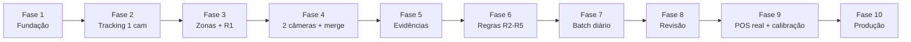

# Plano final de execução — track_fraude

Guia completo do MVP até o projeto fechado, em fases sequenciais. Cada fase tem **objetivo**, **entregas**, **critério de conclusão** e **dependências**. Só avance quando a fase anterior estiver validada.

---

## Visão do produto final

Sistema batch (processamento noturno) que:

1. Ingere vídeo de 2 câmeras + POS (simulado → API real)  
2. Sincroniza timestamps, rastreia pessoas, une câmeras  
3. Detecta entrada, sessões de caixa (múltiplas), saída  
4. Cruza com POS e aplica regras R1–R5  
5. Gera alertas com timeline + clips cam1/cam2 para revisão humana  

**Stack base:** Python, Ultralytics YOLOv8, OpenCV, Shapely, JSON/Parquet (MVP), FFmpeg, FastAPI (futuro).

**Fora de escopo no núcleo:** LLM, identificação de SKU pelo vídeo, condenação automática.

---

## Mapa das fases



| Fase | Nome | Duração sugerida | Complexidade |
|------|------|------------------|--------------|
| **1** | Fundação e sync temporal | 1–2 semanas | Baixa |
| **2** | Tracking em 1 câmera | 1–2 semanas | Média |
| **3** | Zonas, eventos e R1 | 1–2 semanas | Média |
| **4** | 2 câmeras + Re-ID / merge | 2 semanas | Alta |
| **5** | Pacotes de evidência (clips) | 1 semana | Média |
| **6** | Regras completas + multi-sessão caixa | 2 semanas | Alta |
| **7** | Pipeline batch diário (24 h) | 1–2 semanas | Média |
| **8** | Interface de revisão | 2 semanas | Média |
| **9** | POS real, calibração e métricas | 2–3 semanas | Alta |
| **10** | Produção e escala | contínuo | Alta |

**Total estimado até MVP operacional (Fases 1–8):** ~12–16 semanas  
**Projeto completo (Fases 1–10):** ~16–22 semanas (depende de acesso à loja/POS)

---

## Fase 1 — Fundação e sync temporal

### Objetivo
Estabelecer estrutura do projeto, POS simulado e **relógio unificado** vídeo ↔ POS.

### Entregas
- Estrutura de pastas (`core/`, `server/`, `data/` com `raw/`, `pos/`, `processed/`, `output/`, `src/`, `jobs/`)
- Pacote `track-fraude-core` (SQLite) + painel web (`server/`) para cadastro de lojas
- Schema JSON POS + cenários simulados (normal, sem venda, cancelada)
- Interface `PosClient` + `FilePosClient`
- OCR de timestamp (ROI fixa) → `sync_map.json` por câmera
- Script de validação: dado um horário, localiza frame e transações POS no intervalo
- `pipeline_state.json` (esqueleto)
- Repositórios abstratos (`TrackRepository`, etc.) — implementação em arquivo

### Critério de conclusão
- [ ] 1 vídeo de teste + 1 JSON POS com horários alinhados  
- [ ] Script responde: “frame X = 06:14:22” e “vendas entre 06:10–06:15 na lane 3”  
- [ ] Documentação do schema POS e sync_map  

### Não fazer ainda
YOLO, zonas, alertas, clips.

---

## Fase 2 — Tracking em 1 câmera

### Objetivo
Detectar e rastrear **múltiplas pessoas** em uma câmera; persistir tracks.

### Entregas
- `pip install ultralytics opencv-python pyarrow` (Parquet)
- `jobs/run_track.py --camera cam1 --date YYYY-MM-DD`
- YOLOv8 + ByteTrack (`vid_stride` configurável)
- Saída: `processed/{date}/cam1/tracks.parquet` + `manifest.json`
- Cada linha: `track_id`, `frame_idx`, `t_abs`, `bbox`
- (Opcional) embeddings Re-ID por track para Fase 4
- Teste com clip 5–15 min, CPU ok (`yolov8n`)

### Critério de conclusão
- [ ] Vídeo curto: ≥3 pessoas com `track_id` estável na maior parte do tempo  
- [ ] Parquet legível + overlay de debug (bbox + id no vídeo)  
- [ ] Tempo absoluto em cada detecção via sync_map  

### Dependências
Fase 1 (`sync_map` pronto).

---

## Fase 3 — Zonas, eventos e primeira regra (R1)

### Objetivo
Configurar polígonos, gerar timeline e **primeiro alerta de fraude** (ficou no caixa sem venda).

### Entregas
- Ferramenta/script de desenho de polígonos → `config/zones_cam2.json` (lanes + entrada/saída cam1)
- Validação visual: overlay polígono + foot point + track_id
- Job `run_events.py`: FSM com histerese (~3 s)
  - `entered`, `left`, `checkout_sessions[]` (suporta múltiplas sessões desde já)
- Job `run_pos_match.py`: match por sessão `[t_start - δ, t_end + δ]`, `lane_id`
- Job `run_alerts.py`: **R1** apenas
- Saída: `data/processed/{group}/{store}/{date}/events/timelines.json`, `data/output/{group}/{store}/{date}/alerts/index.json`

### Critério de conclusão
- [ ] Cenário simulado: pessoa no caixa 3, 5 min, zero venda → alerta R1  
- [ ] Cenário normal: venda no intervalo → sem R1  
- [ ] Duas pessoas em lanes diferentes → alertas independentes  

### Dependências
Fases 1–2.

---

## Fase 4 — Duas câmeras + merge (Re-ID)

### Objetivo
Processar cam1 e cam2 **em fila**, persistir por câmera, **unificar** mesma pessoa.

### Entregas
- Pipeline fila: TRACK cam1 → TRACK cam2 → MERGE
- `processed/{date}/cam2/tracks.parquet`
- Job `run_merge.py`:
  - embedding + janela temporal
  - saída: `persons.json`, `cross_camera_links.json`
- Job EVENTS lê `global_person_id` (timeline unificada)
- POS match e R1 por pessoa unificada
- `pipeline_state.json`: status por câmera + merge

### Critério de conclusão
- [ ] Mesma pessoa entrada (cam1) + checkout (cam2) → 1 `global_person_id`  
- [ ] 2 pessoas cruzando → 2 persons sem troca  
- [ ] R1 funciona com timeline das duas câmeras  

### Dependências
Fases 1–3 (zones cam1 entrada/saída, cam2 checkout).

---

## Fase 5 — Pacotes de evidência (clips)

### Objetivo
Revisor recebe **timeline + clips cam1/cam2** por alerta, não o dia inteiro.

### Entregas
- Job `run_evidence.py`
- `evidence_window`: `buffer_before` / `buffer_after` (default 20 s)
- Corte FFmpeg por timestamp (suporta chunks horários via manifest)
- Estrutura por alerta:

```text
data/output/{group_code}/{store_id}/{date}/alerts/AL-XXXX/
  timeline.json
  pos_context.json
  summary.txt
  cam1_clip.mp4
  cam2_clip.mp4
```

- Cap de duração (ex.: 5 min) + clip opcional focado no checkout

### Critério de conclusão
- [ ] Alerta R1 inclui clips sincronizados + resumo textual  
- [ ] Revisor entende o caso sem abrir vídeo de 24 h  

### Dependências
Fase 4 (persons + alertas).

---

## Fase 6 — Regras completas e multi-sessão no caixa

### Objetivo
Cobrir skip checkout, cancelamento, inconsistência de itens; tratar **sair do caixa e voltar**.

### Entregas
- **R2**: entrou, não passou no caixa (ou zero POS), saiu com sacola  
- **R5**: transação cancelada + sacola na saída  
- **R3** (Fase 1 visual): sacola grande + `qty_total` POS baixo (margem conservadora)  
- **R4** (opcional): tempo curto vs muitos itens POS  
- **R1b**: suprimir/rebaixar R1 se sessão posterior tiver venda no mesmo lane dentro de `T_return` (ex.: 30 min)  
- Alertas só após `left_store` ou com flag de prioridade  
- Detecção sacola (YOLO classe ou proxy)  
- Score composto (pesos por regra × confiança)

### Critério de conclusão
- [ ] Cenários simulados para R1, R1b, R2, R5 passam  
- [ ] “Saiu do caixa, pegou item, voltou e pagou” → sem falso positivo grave  
- [ ] “Entrou, não passou no caixa, saiu com sacola” → R2  

### Dependências
Fases 3–5.

---

## Fase 7 — Pipeline batch diário (produção de dados)

### Objetivo
Processar **1 dia completo** (24 h ou turno): ingestão, fila, validação de gaps.

### Entregas
- `data/raw/video/{date}/` + `manifest.json` (1 ou N chunks/câmera)
- Job INGEST: valida integridade, gaps, POS do dia
- `jobs/run_daily_pipeline.py --date --store`
- Ordem: INGEST → SYNC → TRACK cam1 → TRACK cam2 → MERGE → EVENTS → POS → ALERTS → EVIDENCE
- Amostragem: `vid_stride` / FPS adaptativo (corredor 1–2 FPS, checkout 3–5 FPS)
- Agendador (Task Scheduler / cron) batch noturno
- Retenção: política de raw vs clips

### Critério de conclusão
- [ ] 1 dia real ou simulado (2 câmeras) processa ponta a ponta  
- [ ] `index.json` + pasta de alertas pronta de manhã  
- [ ] Rerodar job isolado (ex.: só MERGE) funciona  

### Dependências
Fases 1–6.

---

## Fase 8 — Interface de revisão

### Objetivo
Operador revisa fila de alertas sem abrir pastas manualmente.

### Entregas (MVP UI)
- FastAPI backend lendo `data/output/{group}/{store}/`
- Lista: data, score, regras, horários entrada/saída, lane
- Detalhe: timeline, POS, player 2 clips (cam1 | cam2)
- Status: `pending_review` | `confirmed` | `dismissed`
- Persistir decisão (JSON ou SQLite inicial)

### Critério de conclusão
- [ ] Revisor processa 10 alertas do dia na UI  
- [ ] Marca falso positivo / confirmado  
- [ ] Link direto para clips  

### Dependências
Fase 5–7.

**Alternativa mínima:** pasta + `index.json` + player local — UI pode ser Fase 8b se atrasar.

---

## Fase 9 — POS real, calibração e métricas

### Objetivo
Trocar simulado por API/export real; calibrar loja; medir qualidade.

### Entregas
- `HttpPosClient` ou import CSV do POS real
- Mapeamento `lane_id` vídeo ↔ terminal POS
- Calibração: `T_min`, `δ`, buffers, thresholds por loja
- Conjunto de casos rotulados manualmente (30–50 eventos)
- Métricas: precision/recall alertas, taxa match track↔TX, falsos positivos/turno
- Ajuste zonas e Re-ID com vídeo real da loja

### Critério de conclusão
- [ ] Pipeline roda com POS real por ≥1 semana piloto  
- [ ] Precision@K documentada em casos revisados  
- [ ] Parâmetros calibrados por loja no **painel web** (SQLite)  

### Dependências
Fases 1–8 + acesso POS/loja.

---

## Fase 10 — Produção e escala

### Objetivo
Operação estável, manutenção, evolução opcional.

### Entregas
- Migrar metadados para **PostgreSQL** (jobs, persons, alerts, review)
- Manter tracks em Parquet ou object storage
- Monitoramento: job falhou, gap vídeo, OCR drift
- Multi-loja: `store_id` em todos artefatos
- LGPD: retenção, blur rosto (se exigido), base legal
- (Opcional) balança checkout / câmera top-down / near-real-time
- Documentação operacional e runbook

### Critério de conclusão
- [ ] 1 loja em produção batch estável  
- [ ] Runbook: o que fazer se NVR falhar, POS atrasar, GPU cair  
- [ ] Roadmap pós-MVP definido (multi-loja, DB, sensores)  

---

## Artefatos por fase (referência rápida)

| Fase | Arquivos / jobs principais |
|------|----------------------------|
| 1 | `transactions.json`, `sync_map.json`, `PosClient` |
| 2 | `tracks.parquet`, `run_track.py` |
| 3 | `zones_*.json`, `timelines.json`, R1 |
| 4 | `persons.json`, `run_merge.py` |
| 5 | `AL-*/cam*_clip.mp4`, `summary.txt` |
| 6 | R2–R5, score, R1b |
| 7 | `manifest.json`, `run_daily_pipeline.py` |
| 8 | API + UI revisão |
| 9 | `HttpPosClient`, métricas, calibração |
| 10 | Postgres, multi-loja, runbook |

---

## Regras de ouro do projeto

1. **Sync antes de tracking** — sem relógio, nada fecha.  
2. **Uma pessoa = um `global_person_id`** — loop em persons, não “a loja”.  
3. **Caixa = polígono pré-configurado** + foot point + histerese.  
4. **POS por sessão de caixa** — múltiplas idas = múltiplas sessões.  
5. **Itens pagos = POS**; **itens levados = estimativa visual** — nunca SKU pelo vídeo amplo.  
6. **Alerta ≠ condenação** — sempre revisão humana + clip.  
7. **MVP em arquivos** — DB na Fase 10 (ou 8 se UI exigir SQLite).  
8. **Sem LLM** no núcleo.

---

## Por onde começar amanhã (Fase 1 — dia 1)

1. Subir painel web (`server/`) e cadastrar loja + câmeras (OCR ROI)  
2. Definir schema `transactions.json` + 3 cenários de teste  
3. Implementar `FilePosClient`  
4. Extrair 1 frame, validar ROI do timestamp, rodar OCR  
5. Gerar `sync_map.json` e script que cruza intervalo com POS  

Quando os 5 itens da Fase 1 estiverem ok → **Fase 2**.

---

## Checklist master (projeto completo)

```
Fase 1  [ ] POS simulado  [ ] OCR sync  [ ] validação temporal
Fase 2  [ ] YOLO track 1 cam  [ ] tracks.parquet
Fase 3  [ ] zonas  [ ] timeline  [ ] R1  [ ] match POS
Fase 4  [ ] 2 câmeras  [ ] merge/Re-ID  [ ] persons.json
Fase 5  [ ] clips cam1+cam2  [ ] summary + timeline alerta
Fase 6  [ ] R2 R3 R5  [ ] R1b multi-sessão  [ ] score
Fase 7  [ ] batch 24h  [ ] manifest  [ ] pipeline diário
Fase 8  [ ] UI revisão  [ ] status alertas
Fase 9  [ ] POS real  [ ] calibração  [ ] métricas
Fase 10 [ ] produção  [ ] DB  [ ] runbook  [ ] LGPD
```

---

Este plano consolida tudo que definimos: batch noturno, JSON/Parquet, fila por câmera + merge, zonas, multi-pessoa, multi-sessão no caixa, buffers, regras R1–R5 e revisão com clips.

Se quiser, em **Agent mode** posso gravar este plano no `esbouço.md` como seção **“Plano final de execução”** e alinhar as semanas antigas (839+) a estas 10 fases para ficar um único guia no repositório.